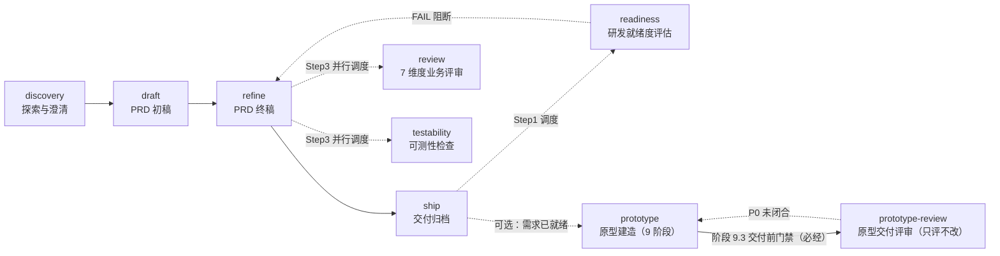

# PRD 技能集

Polaris Flow 的**需求工程技能族**：把一段模糊的需求想法，经过「澄清 → 初稿 → 终稿 → 交付」四个阶段，产出研发、测试、验收可用的产品需求文档。

## 主链路



- 四个主阶段**严格串行**：`discovery → draft → refine → ship`
- `review` / `testability` / `readiness` **不是独立阶段**：`review` 与 `testability` 由 `refine` 的 Step 3 调度，`readiness` 由 `ship` 的 Step 1 调度；三者均可被用户单独调用（初稿评审、变更评审、准出判定）
- `review` 与 `testability` 可**并行**；`readiness` 在 `ship` 阶段执行，消费前两者的结论作为评分证据源
- `prototype` → `prototype-review` 是**需求链路的下游支线**（需求已就绪才做原型），不进主链路串行。支线内部**评审是建造的第 9.3 步、必经门禁**：`prototype` 未取得「可交付 / 修复后可交付」结论不得交接（详见 `prototype/SKILL.md §四 4.4–4.5`）；`prototype-review` 也可由用户单独调用评审任何已有原型
- 每个阶段都有硬阻塞点，**未获人工确认不得进入下一阶段**

## 阶段一览

| # | 阶段 | 技能 | 核心输入 | 主产物 | 下游 |
|:--:|:--|:--|:--|:--|:--|
| 1 | 探索与澄清 | `discovery` | 用户原始需求 / 想法 | 《需求基线》+《需求澄清纪要》+**需求中文名与编号前缀** | `draft` |
| 2 | PRD 初稿 | `draft` | 需求基线（唯一需求源）+ 澄清纪要 | 4 章轻量初稿（5 个分章文件）+ 交叉校验报告 | `refine` |
| 3 | PRD 终稿 | `refine` | 初稿 + 需求基线 + coding-knowledge | 11 章 + 4 附录正式终稿 + 评审报告 + 评审支撑包 | `ship` |
| 4 | 交付归档 | `ship` | 已通过人工评审的终稿 | **研发就绪度评估（准出判定）** + 终稿按 `{前缀}-{中文名}-需求终稿-v1.0.md` 移入文档库，任务状态置完成 | 结束 |
| — | 业务评审 | `review` | PRD（初稿/终稿）+ 可选基线 | 7 维度评审报告（P0~P3 分级） | 回 `refine` 修复 |
| — | 可测性检查 | `testability` | PRD（初稿/终稿） | 四维度可测性报告（T0~T3 + 补全建议） | 回 `refine` 修复 |
| — | 研发就绪度评估 | `readiness` | **定稿终稿** + 前置两份评审报告 + 基线 | 五维度加权评分 + PASS/CONDITIONAL/FAIL 判定 + 缺陷清单 + 重点阅读指引 | FAIL **阻断交付**回 `refine`；PASS/CONDITIONAL 放行 |
| — | 原型建造（可选支线） | `prototype` | 定稿 PRD / 需求基线 / 建设方案 / Agent 设计文档 | 6+1 交付物（含高保真可交互 HTML 原型，均落盘）；三层验证执行体 `verify.mjs` 与实现纪律在此 | **9.3 调用 `prototype-review`（必经门禁）** |
| — | 原型交付评审（可选） | `prototype-review` | 原型 `.html` + 可选黄金流 / 需求文档 / 设计规范 | 评审报告：三层验证结果 + 结论 + P0–P3 分级问题清单与整改建议；**质量判据本体在此** | 回 `prototype` 修复后重评审 |

> 技能全名为 `polaris{{SKN_SPR}}prd{{SKN_SPR}}<阶段>`（`{{SKN_SPR}}` 为构建期注入的名称分隔符占位符，全族一致）。命令入口按构建产物的实际名称调用。

## 目录结构

```
prd/
├── discovery/                     # 阶段1 探索与澄清
│   ├── SKILL.md
│   ├── policies/complexity-assessment-policy.md
│   └── templates/req_baseline_template.md, req_clarify_summary_template.md
├── draft/                         # 阶段2 PRD 初稿
│   ├── SKILL.md
│   ├── policies/key-points-management.md, writting-rules.md
│   └── templates/prd_draft_template.md       # 初稿内容标准（现行，与流程对齐）
├── refine/                        # 阶段3 PRD 终稿
│   ├── SKILL.md
│   └── templates/prd-template.md             # PRD 统一模板 v2.0（11章+4附录）
├── review/                        # 7 维度业务评审（refine 调度 / 独立调用）
│   ├── SKILL.md
│   └── templates/review_report_template.md
├── testability/                   # 可测性专项检查（refine 调度 / 独立调用）
│   ├── SKILL.md
│   └── templates/testability_report_template.md
├── readiness/                     # 研发就绪度评估（ship Step 1 调度 / 独立调用）
│   ├── SKILL.md
│   └── templates/readiness_report_template.md
├── ship/                          # 阶段4 交付归档
│   └── SKILL.md
├── prototype/                     # 原型建造（9 阶段 / 6+1 交付物；执行体与实现纪律在这里）
│   ├── SKILL.md
│   ├── references/01–07           # ref07 §27.1 三层验证规格、§28–§32、§35 建造调用方式；§33/§34/§36 已上移（留编号壳）
│   ├── scripts/verify.mjs, scaffold.mjs
│   ├── assets/default-tokens.css
│   ├── example/, evals/
│   └── PROVENANCE.md
├── prototype-review/              # 原型交付评审（只评不改；**质量判据唯一来源在此**）
│   ├── SKILL.md
│   ├── references/01-quality-criteria.md      # §33 五维清单 / §34 一票否决 31 条 / §36 最终判断标准
│   ├── templates/prototype_review_report_template.md
│   └── evals/
└── backup/                        # 历史版本存档（prd-draft v0.1/v0.2），不参与运行
```

## 阶段详解

### 1. discovery — 探索并澄清需求

**触发**：给出需求想法/文档，需要先理清需求、识别模糊点、推导功能架构。

**HARD-GATE**：事实与假设严格分离｜问题域与方案域解耦｜极简拆解不脑补｜定向扫描不越界｜澄清问题封闭化｜变更全程可追溯。

**流程**：

| Step | 动作 | 要点 |
|:--:|:--|:--|
| 0 | 产物语言 | 读 `.polaris/config.yaml` 的 `language`，未配置回退请求语言 |
| 1 | 状态检查 / 中断恢复 | `task-init.sh` 按 `INIT_EXIT` 判定；`existing` 时按 A/B/C/D 决策点询问 |
| 2 | 初始化与前置校验 | 扫描既有产物 → 复杂度**初判** → 跨系统拆分校验（≥2 系统即暂停拆分）→ `task_id` 确认（kebab-case，阻塞点）→ 落盘需求基线 |
| 3 | 理解 + 结构化拆解 | 极简五要素拆解 → 四类资源定向扫描（本地文档/代码/MCP/网络）→ 方案与需求解耦 → 复杂度**二次校准**（宁严勿松，只升不降） |
| 4 | 业务层模糊点澄清 | 8 维度扫描 + 6 项必问项强制校验 + 四维度合理性校验 → 高/中/低分级 → 分轮澄清（先业务后架构，每轮立即增量落盘） |
| 5 | 功能架构推导 | 一/二级模块拆分 + 六大方法反向挖掘架构层模糊点 + L1 代码级存在性验证 |
| 6 | 架构层澄清 | 合并架构模糊点与用户候选方案，先架构后方案，分轮澄清 |
| 7 | 固化与终版输出 | 终审架构 → 正式架构固化 → 六项必问项终检 → 全文档一致性 → 用户确认（**阻塞点**） |

**复杂度三档联动**：

| 等级 | 模糊点扫描 | 合理性校验 | 澄清交互模式 | 架构输出 |
|:--:|:--|:--|:--|:--|
| 简单 | 核心 3 维度 | 业务合理性单点 | 单轮批量提交 | 单层功能清单 |
| 标准 | 全量 8 维度 | 业务/技术/合规/成本 | 高-中-低分 3 轮 | 双层架构 + 依赖 |
| 复杂 | 全量 8 维度 | 全量 | 强制**单轮单问** | 双层架构 + 能力引用矩阵 + 规则 ID |

**命名与编号**（Step 2 产出，全链路复用）：

- 三项标识：`task_id`（kebab-case 目录名）、**需求中文名**（4–12 汉字）、**需求编号前缀**（大写 ASCII 2–16 位）
- 中文名与前缀在**选中任务后（Step 2.6.1）直接询问**确定：中文名由 AI 建议 3 个候选供用户选择（也可自拟），编号前缀由用户输入，确认后写入 `state.yaml` 的 `naming`（`status: confirmed`）与基线元数据区
- 下游由此获得统一命名空间：draft 锚点 `{前缀小写}-cap-001`、refine 模块/功能点/规则 `{前缀}-F01-01` / `{前缀}-BR-101`、ship 交付文档 `{前缀}-{中文名}-需求终稿-v1.0.md`

**产出**：`req_baseline.md`（9 章）、`req_clarify_summary.md`（5 章）。退出条件为用户**明确整体确认**（"差不多/可以吧"、仅对某条提意见、沉默均不算确认）。

### 2. draft — 编写 PRD 初稿

**触发**：持有《需求基线》与《需求澄清纪要》，需逐章产出 PRD 初稿。

**HARD-GATE**：需求源唯一性（仅基线为功能需求源）｜事实与假设分离｜方案域不越界（不写表/接口/类名/排期/埋点）｜Gate 不过不生成｜语言无歧义｜变更可追溯。

**流程**：

| Step | 动作 | 产物 |
|:--:|:--|:--|
| 0 | 定位 `task_id`，写 `current_verb: draft` | — |
| 1 | 前置校验 Gate（基线存在 + 结构完整 + 复杂度等级 + 边界声明） | `state.yaml`（`draft.gate`） |
| 2 | 加载解析：实体锚点（`{前缀小写}-cap-xxx`/`{前缀小写}-scene-xxx`）+ 人工重点识别 + 问题-方案-目标框架 + 图表计划 | `_baseline_index.json`、`_key_points.json` |
| 3 | **逐章生成，一章一确认**：生成 → 三重自检（编写规则/重点项/重点优化）→ 用户确认 → 落盘 | `final/01-需求背景.md`、`02-业务流程与时序.md`、`03-需求详情-通用能力层.md`、`03-需求详情-业务场景层.md`、`04-版本记录.md` |
| 4 | 交叉验证：功能覆盖矩阵 + 锚点校验 + 重点保留率 + 初稿边界三问 | `_cross_check_report.md` |
| 5 | 合并全文、全局质量自检、交付说明、归档 sessions | PRD 初稿 |

**章节构成**（落盘 5 个文件、4 个章节）：01 需求背景｜02 业务流程与时序｜03 需求详情（通用能力层 + 业务场景层两个文件）｜04 版本记录；合并阶段在首章前统一生成文档头部（评审重点指引、问题-方案-目标摘要）与图表索引。

**关键门禁**：重点保留率（完整保留 + 语义保留）/总重点项 **≥ 95%**，否则不允许进入交付。

**写作要求**：先图后文（架构/流程/状态机/线框）｜MoSCoW 分级排序（MUST 在前、WON'T 单独排除段）｜「用户故事 + 业务规则」格式｜业务场景层用锚点引用通用能力，禁止大段复制｜风险与排除项仅到提纲级。

**复杂度联动**：

| 等级 | 图表深度 | 风险清单 | MoSCoW | 边界声明 |
|:--:|:--|:--|:--|:--|
| 简单 | 仅核心流程图 | 1–3 条 | MUST/SHOULD | 轻量 |
| 标准 | 架构 + 主流程 + 关键状态机 | 四类各 1–2 条 | 三级 | 标准 |
| 复杂 | 全量图 + 图表索引 | 四类完整含降级 | 四级含 WON'T | 详尽 |

> 本阶段**不评审业务合理性**，只校验「有没有写、重点是否保留、引用是否合法、边界是否合规」。

### 3. refine — 编写 PRD 终稿

**触发**：已有经人工确认的 PRD 初稿，需补全为正式终稿。无初稿不生成终稿。

**HARD-STOP**：终稿必须严格遵循 `./templates/prd-template.md`（**11 章 + 4 附录**），禁止偏离章节顺序与命名；终稿阶段禁止修改初稿已确认的核心逻辑与范围；禁止脱离基线凭空新增；禁止跳过模板一致性终检与评审直接定稿。

**流程**：

| Step | 动作 | 产物 |
|:--:|:--|:--|
| 0 | 状态检查 / 中断恢复（`--phase refine`），写 `refine.status` | — |
| 1 | 模板强制加载 + 全量输入加载 + 继承章节映射 + **基线-终稿双向追溯矩阵** + 补全范围确认 | `_phase1_analysis.md`、`_baseline_trace_matrix.csv` |
| 2 | 逐章补全：生成 → L2 代码验证 → 8 项章节自检 → 落盘（待确认）→ 人工确认 | `final/01-概述.md` … `11-风险与开放问题.md`、`_appendix-a~d.md`、`_chapter_state.md` |
| 2.5 | 合并终稿全文（仅收「已确认」章节），定稿前清理占位符 | `_prd_final_draft.md` |
| 3 | 双评审（业务/可测性）+ 修复闭环 + 人工评审支撑包 | `full_review_report.md`、`review-package/` |
| 4 | 定稿落盘 → **模板一致性终检（含编号前缀一致性，强制门禁）** → 格式校验 → 追溯矩阵回写 → 正式声明 → 归档 | `prd-final-v1.0.md`（任务内固定名；交付名在 ship 生成） |

**章节来源**：继承增强（一 概述、二 角色与权限、三 业务流程与用户旅程、五 功能需求）；新增生成（四 数据模型、六 业务规则汇总、七 状态流转、八 非功能需求、九 依赖与约束、十 验收与度量、十一 风险与开放问题）。

**初稿 → 终稿重构映射**：通用能力层 → 模块级「通用处理流程」+「前置公共约束」；业务场景层 → 对应功能模块下的功能点；初稿锚点 → 模块内/跨模块功能点引用。

**L2 代码验证**（存在 coding-knowledge 时）：术语定义枚举、第四章数据模型（字段/类型/长度/非空/枚举/默认值/关联）、状态枚举；不一致以代码为准，无法确认的标记「待技术确认」。无 coding-knowledge 时降级为 L1 设计级并标注。

**章节间勾稽**：`1.6 需求来源 ↔ 附录A`｜`2.2 权限矩阵 → 10.4 安全验收`｜`4.3 实体状态机 ↔ 7.3 全量状态机`（冲突以第七章为准）｜`5.2 业务规则 → 第六章`（只引用 `{前缀}-BR-XXX`，禁止重复定义）｜`第六章 → 11.2 待确认事项`。

**Step 3 双评审**（`subagent-probe` → 选定 agent → `subagent-dispatch`）：

| 子步骤 | 内容 | 分级 | 阻塞处理 |
|:--:|:--|:--|:--|
| 3.1 | 7 维度业务评审（[review](./review/SKILL.md)）：业务一致性、范围完整性、逻辑自洽性、规则明确性、可实现性、合规性、基线双向一致性 | P0~P3 | P0 清零才能定稿 |
| 3.2 | 四维度可测性检查（[testability](./testability/SKILL.md)）：验收标准完整性、业务规则可判定性、场景覆盖充分性、数据指标可验证性 | T0~T3 | T0 清零才能定稿 |

- 3.1 与 3.2 **共享一次 probe 结果**、可并行派发，但必须评审同一个 `_prd_final_draft.md`；任一章节被修订须先重跑 2.5 再重新派发
- 平台不支持 subagent 时自动降级为主代理 inline 执行，并在报告中标注
- **修复-重评审闭环**：改分章文件 → 重新确认 → 重跑 2.5 → 重新派发 → 直到 P0/T0 清零
- 3.4 输出人工评审支撑包：阅读指引、重点标注版终稿、评审议题清单、争议停车场模板、行动项模板

> **本阶段只保证文档质量达标（P0/T0 清零），不产出准出结论。**「能否交付研发进入技术设计」由 `ship` 调用 `readiness` 独立判定——判定者与执行者分离，且评估对象是定稿后的最终版本，避免「评估 A 版本、交付 A' 版本」。

**中断恢复**（以 `final/_chapter_state.md` 为唯一依据）：存在「待确认」章节 → 重新提交确认；全部已确认 → 从 2.5 合并；有草稿无评审报告 → 从 Step 3；有评审报告无终稿 → 从 3.3/Step 4。

### 4. ship — 交付 PRD 终稿

**触发**：终稿已通过人工评审，需交付至指定文档位置并收尾任务。

**流程**：

| Step | 动作 | 产物 |
|:--:|:--|:--|
| 0 | 状态检查与中断恢复 | — |
| 1 | **研发就绪度评估（准出判定）**：评估对象为定稿终稿 `prd-final-v1.0.md`，消费 Step 3 两份评审报告作证据源；版本未变时复用已有评估 | `readiness_report.md` |
| 2 | 人工确认（**话术必带就绪度结论**）：PASS/CONDITIONAL → A 确认交付 / B 暂停回 `refine`；**FAIL → 硬阻断**，默认只给「暂停回 refine」 | `state.yaml`（`ship.readiness_verdict`） |
| 3 | 转移终稿至 `$PRD_DOC_DIR`（默认 `$REPO_ROOT/docs/prd/`）+ 更新任务状态为完成 | 交付文档 |

**职责边界**：`refine` 保质量（P0/T0 清零），`ship` 判准出（能否给研发）。**P0/T0 清零 ≠ 可交付研发**。

**FAIL 回流**：暂停回 `refine` → 按就绪度报告的阻断级缺陷定位修复 → 重新定稿 → 重新执行 `ship`（Step 1.2 版本比对会触发重评，**且 FAIL 修复后不得免评**）。

**免评机制**（`readiness` Step 0）：默认评估、命中条件才豁免（黑名单式）。免评须 **E1 纯文案变更 + E2 有历史 PASS/CONDITIONAL + E3 不确定性未增加** 三条全满足，且未命中强制信号 **F1 首次交付 / F2 D4 子项变更 / F3 本轮修过 P0·T0 / F4 跨团队或外部接口 / F5 用户要求**；连续免评 2 次后第 3 次强制全评。**免评豁免的是评估动作而非准出判定**——仍须落 `PASS（免评）` 结论与命中依据，人工可在 Step 2 选择「改为全评」。

### review / testability / readiness / prototype-review — 评审类技能（被上游调度，也可独立调用）

| 技能 | 维度 | 分级 | 硬约束 |
|:--|:--|:--|:--|
| `review` | 业务一致性、范围完整性、逻辑自洽性、规则明确性、可实现性、合规性、基线双向一致性 | P0 阻塞 / P1 重要 / P2 一般 / P3 待确认 | 只评审不修改；问题必须定位到章节+锚点并给出改进建议；禁止跳过维度 |
| `testability` | 验收标准完整性、业务规则可判定性、场景覆盖充分性、数据指标可验证性 | T0 阻塞 / T1 重要 / T2 一般 / T3 建议 | 只检查不修改；每个不可测点必须给出 GWT 格式的补全建议；禁止跳过维度 |
| `readiness`（由 `ship` Step 1 调度） | 需求覆盖与可追溯（16%）、准确性与内部一致性（16%）、无歧义与可判定（22%）、技术设计支撑度（33%）、不确定性与风险管理（13%） | PASS ≥80 / CONDITIONAL 60–79 / FAIL <60；D1/D2/D3/D4 任一 <60 一票否决 | 只评估不修改；评估对象必须是**定稿终稿**；缺陷必须定位到章节+锚点；**不重复判定 review/testability 已覆盖的问题**（消费其结论作证据源）；分数只是排序信号，报告主体是缺陷清单与重点阅读指引 |
| `prototype-review` | 原型五维（业务 / 结构 / 交互 / 视觉 / 研发）+ 演示就绪 + 一票否决 31 条 + 三层运行时验证 | P0 阻断 / P1 重要 / P2 一般 / P3 待确认 | **只评审不修改（原型一行都不改）**；**质量判据唯一来源在本技能**（`references/01-quality-criteria.md` 的 `§33` / `§34` / `§36`，2026-09-14 从 prototype 的 ref07 迁入、编号沿用），本技能只定义"怎么审"（输入契约 / 走查流程 / 取证要求 / 报告格式）；三层验证必须**实际执行**，执行体 `verify.mjs` 在 prototype，未执行层须标注；禁止跳过维度；禁止替产品经理决定范围 |

四者报告均采用「检查过程视图（按维度）+ 处理决策视图（按等级）」双视图，问题 ID 用锚点一一对应；可测性报告另输出 A/B/C/D 评级（覆盖率 + 可判定率 + T0 数量）；就绪度报告另输出加权总分与重点阅读指引（得分最低 2 维度的必读章节）；原型评审报告另输出三层验证结果与评审对象 `sha256`（证明「评审对象 = 交付对象」且评审过程未改动原型）。

## 产物布局

```
$REPO_ROOT/.polaris/tasks/<task_id>/
├── state.yaml                          # 运行态（阶段游标、status、draft.gate 前置校验结论、naming 命名标识）
├── req_baseline.md                     # discovery：需求基线（9 章，含中文名与编号前缀）
├── req_clarify_summary.md              # discovery：需求澄清纪要（5 章）
│
├── _baseline_index.json                # draft：实体锚点索引
├── _key_points.json                    # draft：人工重点清单
├── prd-draft.md                        # draft：合并后的 PRD 初稿
│
├── final/                           # 过程文件（全程保留，支撑中断恢复）
│   ├── 01-需求背景.md / 02-业务流程与时序.md   # draft 分章
│   ├── 03-需求详情-通用能力层.md
│   ├── 03-需求详情-业务场景层.md
│   ├── 04-版本记录.md
│   ├── _cross_check_report.md
│   ├── 01-概述.md … 11-风险与开放问题.md # refine 分章
│   ├── _appendix-a.md … _appendix-d.md
│   ├── chapter_state.md                # refine 续跑唯一依据（未开始/待确认/已确认）
│   ├── _phase1_analysis.md
│   ├── _baseline_trace_matrix.csv      # 基线-终稿双向追溯矩阵
│   ├── _prd_final_draft.md             # Step3 评审的唯一评审对象
│   ├── full_review_report.md          # 业务评审 + 可测性检查汇总
│   ├── readiness_report.md             # ship Step 1 研发就绪度评估（准出判定）
│   └── review-package/                 # 人工评审支撑包
│
└── prd-final-v1.0.md                   # refine 定稿输出（任务内固定名）
                                        # ship 迁移后 → {前缀}-{中文名}-需求终稿-v1.0.md
```

## 共享约定

1. **技能命名**：`polaris{{SKN_SPR}}prd{{SKN_SPR}}<阶段>`，`{{SKN_SPR}}` 为构建期注入的分隔符占位符，全族（含 `subagent-probe` / `subagent-dispatch`）统一。
2. **模板自包含**：各技能的模板一律放在技能自身 `./templates/`，用技能内相对路径引用，**不搞跨技能 `../` 共享目录**。
3. **策略文件**：技能内引用的 `./policies/decision-point.md`（决策点/阻塞询问）与 `./policies/ask-question-react.md`（封闭式提问）在各技能目录内并未存放，来自共享目录 `assets/zh/policies/`（打包时注入）；技能自有策略（复杂度评估、编写规则、重点项管理）放在各自 `policies/`。
4. **路径**：过程文件统一落 `$REPO_ROOT/.polaris/tasks/<task_id>/`（`tasks` 为复数）；禁止使用相对当前工作目录的路径（refine 可能在独立 worktree 中执行）。
5. **复杂度三档**（简单/标准/复杂）：由 discovery 评分判定并写入基线元数据，`draft` 与 `refine` 读取后按档裁剪内容深度与交互模式。
6. **问题分级与准出**：业务问题 P0~P3，可测性问题 T0~T3；P0/T0 为阻塞项，清零前不得定稿；P3/T3 归入终稿 11.2 待确认事项。**准出由 `ship` 调用 `readiness` 在交付前独立判定**——P0/T0 清零 ≠ 可交付研发，还须通过五维度加权评分与双门槛（总分 ≥80 且 D1/D2/D3/D4 均 ≥60）；FAIL 阻断交付；满足条件时可免评（E1~E3 全满足且无 F1~F5，结论记 `PASS(waived)`，连续 2 次后强制全评）。
7. **基线是唯一需求源**：`draft` 仅以基线为功能需求来源（澄清纪要的最终答复优先于基线中的待定描述）；`refine` 需双向追溯，无基线来源的需求不得纳入终稿。
8. **人工确认是硬阻塞点**：需求基线锁定、逐章落盘、终稿定稿、交付，均需用户明确确认；模糊回复、沉默、仅对某条提意见均不算确认。
9. **全程可追溯**：需求变更记录前后对比与依据；基线-终稿追溯矩阵在 1.6 节、独立 CSV、附录 A 三处保持一致。
10. **命名与编号**（discovery 确定、全链路复用）：每个需求产出三项标识——`task_id`（kebab-case 目录名）、**需求中文名**（4–12 汉字）、**需求编号前缀**（大写 ASCII 2–16 位）。权威存储为 `state.yaml` 的 `naming` 块，基线元数据区同步留痕。编号命名空间：

    | 对象 | 格式 | 示例（前缀 `UAP`） |
    |---|---|---|
    | 交付文档名 | `{前缀}-{中文名}-需求终稿-v1.0.md` | `UAP-用户权限精细化-需求终稿-v1.0.md` |
    | 文档编号 | `{前缀}-PRD-{版本}` | `UAP-PRD-V1.0` |
    | draft 锚点 | `{前缀小写}-cap-001` / `-scene-001` | `uap-cap-001` |
    | refine 模块 / 功能点 | `{前缀}-F01` / `{前缀}-F01-01` | `UAP-F01` / `UAP-F01-01` |
    | refine 业务规则 | `{前缀}-BR-101` | `UAP-BR-101` |

    中文名与前缀在 discovery 选中任务后（2.6.1）直接询问确定：中文名由 AI 建议 3 个候选供用户选择，编号前缀由用户输入，确认后写入 `state.yaml` 的 `naming`。**前缀一经确认全程不变**，变更视同需求变更，须同步修订已产出文档。

## 使用路径

```
/polaris…prd…discovery  {需求名}        → 澄清并锁定需求基线
/polaris…prd…draft      {需求名}        → 逐章生成 PRD 初稿（一章一确认）
/polaris…prd…refine     {需求名}        → 补全终稿 + 双评审 + 人工评审支撑包
/polaris…prd…ship       {需求名}        → 研发就绪度评估（准出判定）+ 交付归档，任务完成
/polaris…prd…readiness  {需求名}        → 单独执行研发就绪度评估（准出判定），不交付归档
```

- 「需求就绪度评估」在 `polaris-flow` 入口中对应 **R03 · 需求就绪度评估**；命令 `/polaris:prd:readiness` 是它的直达入口

- 任一阶段中断后重新调用同一技能即可**从断点续跑**（draft 读 `state.yaml` 的 `draft.gate`，refine 读 `_chapter_state.md`），不需从头重写。
- 只想评审现成文档时，可跳过主链路直接调用 `review` / `testability` / `readiness`（后者需先有前置两份评审报告，否则相关维度按「证据不足」3 分封顶）。

## 修复记录

通读全族技能时发现的 11 项一致性问题已全部修复（2026-09-01）：

| # | 问题 | 修复结果 |
|:--:|:--|:--|
| 1 | 基线/澄清纪要文件名不一致 | 统一为下划线 `req_baseline.md` / `req_clarify_summary.md`（discovery 落盘与 draft 读取对齐；澄清纪要补 `req_` 前缀） |
| 2 | draft 路径 `.polaris/task/` 单数 | 全部改 `.polaris/tasks/`（3 处） |
| 3 / 3b | draft 双模板冲突 | 现行内容标准归位 `templates/prd_draft_template.md`，旧版 `references/prd_template.md` 归档至 `backup/prd_draft_references_prd_template.md` |
| 4 | draft 输出文件名与模板同名 | 改为 `prd_draft.md` |
| 5 | ship 转移命令反斜杠/引号/变量缺失 | 补全：`$PRD_DOC_DIR` 默认 `$REPO_ROOT/docs/prd/`，正斜杠、引号闭合、终稿文件名对齐 refine |
| 6 | ship 状态更新小节为空 | 补全：写 `state.yaml`（`ship.status=completed` 等）+ `delete-active` 移出活跃列表 |
| 7 / 8 | `workflow-entry.sh` 传 `--skill build --phase build` | 已对齐为 `--skill refine --phase refine` / `--skill ship --phase ship`（零匹配提示一并修正） |
| 9 | review 写 `state.yaml: build.build_mode` | 已改为 `refine.build_mode` |
| 10 | 入口校验表「失败 → 阻断」语义含混 | 改为「已完成 → 阻断重跑」（draft/refine/ship 三处） |
| 11 | `refine`/`review`/`testability`/`ship` 缺 `version` | 统一补 `version: 0.3` |

**顺带修复的连带问题**（discovery 侧）：
- `clarify-init.sh` → `task-init.sh`（脚本名笔误）
- `--skill clarify` → `--skill discovery`（复制残留）
- 「重新开始」分支 `--where-task-id "$d"` → `"$task_id"`、`<task_id>` 尖括号 → `$task_id`
- `$REPO_ROOT/tasks/` 缺 `.polaris/`（2 处）
- 补澄清纪要模板 `read_file ./templates/req_clarify_summary_template.md`

> `backup/prd-draft-v0.1`、`backup/prd-draft-v0.2` 为历史版本存档，不参与运行，清理上述问题时无需同步。
