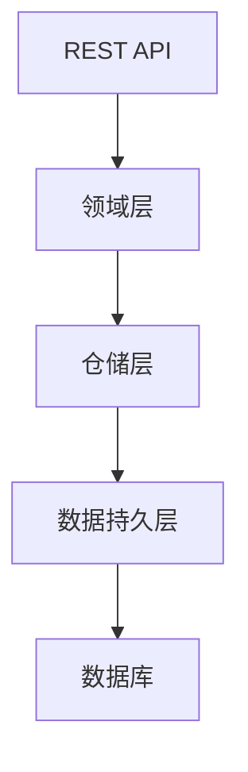

# design-template.md 模板与规则（polaris-flow 工作流 · normal 常规通道）

> **使用约定**：本模板由 `polaris{{SKN_SPR}}coding{{SKN_SPR}}normal` Step 4.3 引用，生成 OpenSpec 四件套中的 `design.md`。
>
> **P02 深度边界**：包含架构决策、模块 / 领域划分、**模块间接口契约**、数据流；**禁止**深化到 `detailed-design.md` / `<slug>-design.md` 专项设计级别——发现需要时记录信号，交 Step 5 升档门判定。
>
> **节名约定**：`## Premises`、`## Constitution Alignment`、`## Alternatives` 三个节名**必须原样保留英文**（Step 7.1 机械终检按英文节名校验）。

## 模板正文

```markdown
# {{CHANGE_ID}} — 技术实现方案

>**编写人**：{name}
>**编写日期**：{YYYY-MM-DD}

## 1. 概述
**背景**：{{BACKGROUND_ONE_SENTENCE}}

**目标**：
{{GOAL}}

**非目标**:
{{NON_GOAL}}

## 2. Premises
{{PREMISES}}

## 3. Constitution Alignment
{{CONSTITUTION_ALIGNMENT}}

## 4. 方案内容
### 4.1 技术栈
{{TECH_STACK}}

### 4.2 整体方案思路

### 4.3 架构总览


### 4.4 模块 / 领域划分
<!-- P02 核心节：模块清单 + 每个模块的职责边界 -->
{{MODULE_DIVISION}}

### 4.5 模块间接口契约
<!-- P02 核心节：跨模块调用的接口、数据结构、时序约定 -->
| 调用方 | 提供方 | 接口 / 契约 | 说明 |
| --- | ------ | ---------- | ---- |
{{MODULE_INTERFACES}}

### 4.6 数据流
{{DATA_FLOW}}

### 4.7 功能实现方案
{{CORE}}

### 4.8 存储方案

#### 4.8.1 持久化方案
{{PERSISTANCE}}

#### 4.8.2 缓存方案
{{CACHE}}

### 4.9 API 实现策略

| 业务域 | 接口名称 | 路径 | 方法 | 业务目的 | 重要程度 |
| --- | ------- | --- | ---  | ------ | ------- |
{{RESTFUL_API_LIST}}

### 4.10 异常、并发、事务处理策略

### 4.11 风险与降级方案
<!-- Step 5 守门选 B 时的「风险接受记录」追加在本节 -->

## 5. Alternatives
{{ALTERNATIVES}}
```

---

## 强制规则

1. **必含节**：`## Premises`、`## Constitution Alignment`、`## Alternatives`（英文节名原样保留，缺任一 → Step 7.1 机械终检阻断）
2. **模块间接口契约**（4.5）与**模块 / 领域划分**（4.4）是 P02 的差异化核心节：多模块协作的契约写在这里，`tasks.md` 的跨模块任务以此为依据
3. **深度上限**：接口写到契约级（谁调谁、传什么、什么时序），不写实现级伪码；需要实现级设计 → 升档信号 D2
4. 路径中如出现模板变量，必须显式写成 `{{...}}` 并在生成时替换为真实值
