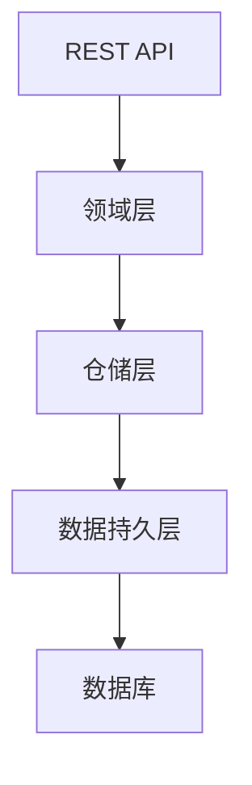

# design-template.md 模板与规则（polaris-flow 工作流）

## 模板正文

```markdown
# {{CHANGE_ID}} — 技术实现方案

>**编写人**：{name}
>**编写日期**：{YYYY-MM-DD}

## 1. 概述
**背景**：{{BACKGROUND_ONE_SENTENCE}}

**目标**：
{{GOAL}}

**非目标**: 
{{NON_GOAL}}

## 2. Premises
{{PREMISES}}

## 3. 宪法对齐
{{CONSTITUTION_ALIGNMENT}}

## 4. 方案内容
### 4.1 技术栈
{{TECH_STACK}}

### 4.2 整体方案思路

### 4.2 架构总览


### 4.3 领域 / 模块划分
{{DOMAIN/MODULE}}

### 4.4 功能实现方案
{{CORE}}

### 4.4 存储方案

#### 4.4.1 持久化方案
{{PERSISTANCE}}

### 4.4.2 缓存方案
{{CACHE}}

### 4.5 API 实现策略

| 业务域 | 接口名称 | 路径 | 方法 | 业务目的 | 重要程度 |
| --- | ------- | --- | ---  | ------ | ------- |
{{RESTFUL_API_LIST}}

### 4.6 异常、并发、事务处理策略

### 4.7 风险与降级方案

## 5. 未选方案及拒绝理由
{{ALTERNATIVES}}

```