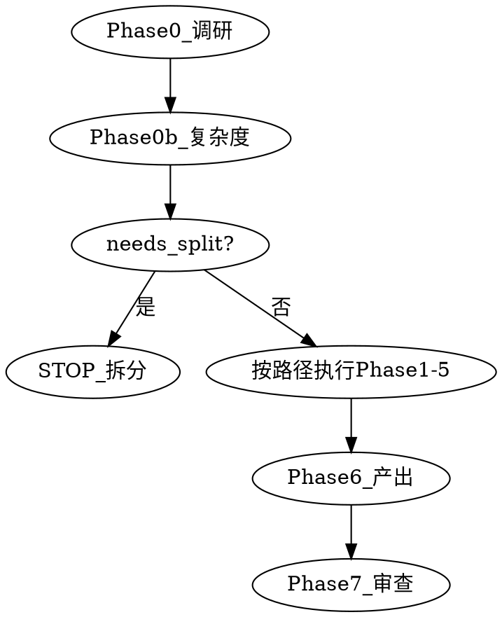

# 意图探索（idea-discovery）

本技能**不是**开放式头脑风暴。产出 `intention.md` 是经调研、复杂度路由、适度澄清与方案收敛后的**意图与方案结论**。

<HARD-GATE>
在用户批准 `intention.md` 之前：禁止编写实现代码、禁止调用实现类技能、禁止搭建项目。
</HARD-GATE>

## 三条铁律

1. **先调研** — Phase 0 不可跳过（simple 任务亦然）。
2. **适度发散** — 仅针对模糊点；已清晰项不再发散。
3. **按复杂度路由** — Phase 0b 判定 simple / standard / complex / needs_split，澄清深度随之缩放。

## 管道

草稿路径（仅 change 目录）：`openspec/changes/<change-name>/intention.md`（Phase 6 前可写 draft 节）

进入 Phase 前 **Read** 对应 `phases/*.md`；细节不在本文件重复。

| Phase | 模块 | 输出 | GATE |
|-------|------|------|------|
| 0 | `phases/00-context.md` | context-brief, fuzzy-points, clear-items | 三项齐全 |
| 0b | `phases/00b-complexity-routing.md` | complexity + 路由理由 | needs_split → STOP 拆分 |
| 1 | `phases/01-targeted-expand.md` | expand-log | simple 或无模糊点 → 跳过 |
| 2 | `phases/02-clarify.md` | clarify-log | simple：0–1 问或跳过 |
| 3 | `phases/03-grill.md` | grill-log | simple 跳过；standard 精简；complex 完整 |
| 4 | `phases/04-converge.md` | options, selected-option | 用户确认方案 |
| 5 | `phases/05-intent-outline.md` | intent-outline-sections | 用户批准意图概要 |
| 6 | `phases/06-artifact.md` | intent.md | 见 `intent-output-template.md` |
| 7 | `phases/07-review.md` | 自检 + 用户批准 | 终止；**不**调用 writing-plans |

**回退：** Phase 3 矛盾 → Phase 2；Phase 5 新模糊点 → Phase 1（仅新点）。

**终止状态：** 用户批准 `intent.md` → 工作流进入 proposal。

## 流程图

## 红线

- 跳过 Phase 0 / 6 / 7 或 HARD-GATE
- 无调研证据标 simple；听用户口令标 simple
- 对 simple 仍跑完整澄清/多方案表演
- 无 OpenSpec CLI 就跳过 OpenSpec（改读 `openspec/` 目录）
- 直接 Read `phases/03-grill.md` 跳过 Phase 0

## 合理化借口表

| 借口 | 现实 |
|------|------|
| 「够清楚了，跳过调研」 | 未对照代码/OpenSpec 的清楚是幻觉 |
| 「用户说简单」 | 必须基于 Phase 0 证据判定 |
| 「simple 不用写 intent.md」 | 仍须产出、自检、批准；用短模板 |
| 「多发散更保险」 | 只针对模糊点；simple 不强行多方案 |
| 「先写代码」 | HARD-GATE 无例外 |
| 「grill 太烦」 | complex/standard 不可跳过；simple 可跳过 Phase 3 |

## 参考文件

- `expand-techniques.md` — 针对性发散技法
- `grill-checklist.md` — Phase 3 拷问清单
- `intent-output-template.md` — 产出模板（含 simple 短版）
- `visual-companion.md` — 视觉伴侣（可选）
- `pipeline.yaml` — 机器可读管道契约
- `baseline-scenarios.md` — 压力测试基线（writing-skills 红阶段）
