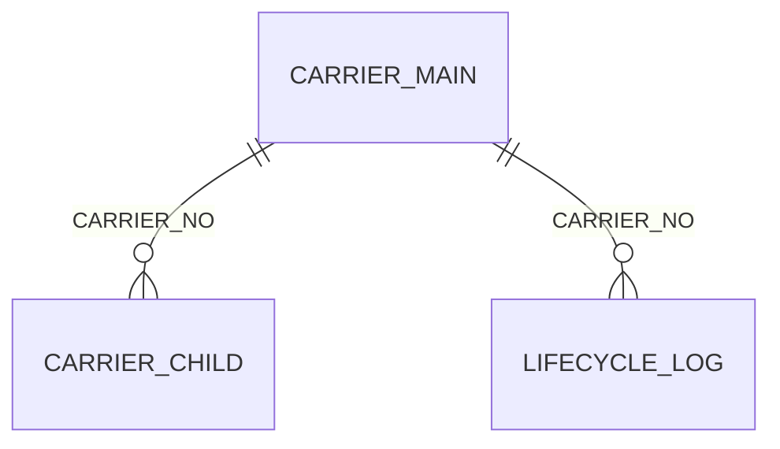
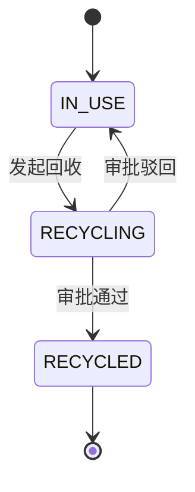

# {{系统/产品名称}} · {{模块/需求名称}} — 产品需求文档（PRD）

> **模板版本**：prd-template v2.0
> **文档状态**：[草案 / 评审中 / 已定稿]
> **文档编号**：{{PRD-YYYY-NNN}}
> **当前版本**：{{V1.0}}
> **编写人**：{{姓名}}
> **所属系统/模块**：{{系统名 / 模块名}}
> **代码验证级别**：L1 设计级 / L2 已代码验证
> **生成时间**：{{YYYY-MM-DD HH:mm:ss}}
> **最后更新**：{{YYYY-MM-DD HH:mm:ss}}

---

## 模板使用约定（定稿前请删除本节）

**标记体系**

| 标记 | 含义 | 处理要求 |
| :--- | :--- | :--- |
| `[必填]` | 任何 PRD 都必须具备 | 缺失即评审不通过 |
| `[条件必填]` | 命中特定条件时必须具备（条件写在章节内） | 未命中则整节删除并注明「不适用」 |
| `[可选]` | 按需裁剪 | 不写亦可，写了就必须写完整 |
| `{{...}}` | 待填充占位符 | 定稿前必须全部替换，不留空占位符 |
| `【填写指引：...】` | 给编写者（人或 Agent）的填写说明 | **定稿输出前全部删除** |

**编写铁则**

1. **可测性优先**：验收标准一律使用 `Given <前置场景> / When <操作> / Then <可观测结果>`，禁止「响应良好」「操作友好」等不可判定表述；如必须定性，须补量化口径。
2. **规则可追溯**：每条业务规则分配唯一规则编码（`BR-XXX`），测试与缺陷单引用该编码。
3. **单一事实源**：同一条规则只在「第 6 章 业务规则汇总」定义一次，功能点内只引用编码，避免多处表述冲突。
4. **异常必须闭环**：每个功能点至少覆盖正常、异常、边界三类场景；7 类标准异常（网络 / 服务 / 权限 / 数据 / 并发 / 第三方依赖 / 业务状态）逐条自查。
5. **图表用 Mermaid**：流程图用 `flowchart`，实体关系用 `erDiagram`，状态流转用 `stateDiagram-v2`，时序用 `sequenceDiagram`。图后必须配文字或表格说明，图不替代规则。
6. **产品语言**：除第 4 章数据模型允许字段名等技术细节外，其余章节不得出现技术实现细节（具体表结构、框架、中间件选型）。
7. **章节裁剪**：小型需求可裁剪 `[可选]` 与未命中的 `[条件必填]` 章节，但**第 1、5、10 章不可裁剪**；裁剪处保留标题并注明「本次不适用」。

---

## 修订记录

| 版本号 | 修订日期 | 修订人 | 修订类型 | 修订内容 | 影响章节 |
| :--- | :--- | :--- | :--- | :--- | :--- |
| {{V1.0}} | {{YYYY-MM-DD}} | {{姓名}} | 创建 | 初始版本 | 全文 |
| {{V1.1}} | {{YYYY-MM-DD}} | {{姓名}} | {{新增/修改/删除}} | {{变更内容描述}} | {{章节号}} |

---

## 一、概述 `[必填]`

### 1.1 业务背景与问题定义

【填写指引：描述业务现状、目标用户处境、核心痛点与系统能力缺口，说明本次建设的业务动因；痛点须有事实或数据支撑，建议 3-5 条，每条对应到 1.2 的一个目标】

{{业务背景描述}}

**当前痛点**

| 痛点编号 | 痛点描述 | 影响范围 | 现状佐证 | 对应目标 |
| :--- | :--- | :--- | :--- | :--- |
| {{P-01}} | {{痛点描述}} | {{用户/角色/业务环节}} | {{数据或案例}} | {{G-01}} |

### 1.2 目标

#### 1.2.1 业务目标
【填写指引：本期要达成的业务结果与价值，上线后可被度量】

1. {{业务目标1，如：载体流转审批周期由 3 天缩短至 4 小时内}}
2. {{业务目标2}}
3. ……

#### 1.2.2 功能目标
【填写指引：逐条列明可验证、可落地的功能建设目标，与痛点一一对应】

1. {{功能目标1，如：实现主/子载体台账统一管理与多条件查询}}
2. {{功能目标2}}

#### 1.2.3 质量目标
【填写指引：数据一致性、准确性、可审计性、稳定性等质量维度目标】

1. {{质量目标1，如：实物载体与电子台账事务强绑定，一一对应}}
2. {{质量目标2}}

#### 1.2.4 非目标（本次明确不做）
【填写指引：列出容易被误认为要做、但本期明确不做的事，比「不包含范围」更强调期望管理】

1. {{非目标1}}
2. ……

### 1.3 范围与边界

#### 包含范围（In）
【填写指引：明确本期覆盖的功能、数据、场景边界，颗粒度到功能点级】

1. {{包含项1}} → 对应功能点 {{F01-01}}
2. {{包含项2}}

#### 不包含范围（Out）
【填写指引：明确交由外部模块实现、本期不建设、后续迭代扩展的能力，防止需求蔓延；每条注明归属与计划】

| 不包含项 | 归属方 | 处理方式 | 计划时间 |
| :--- | :--- | :--- | :--- |
| {{如：载体号生成规则}} | {{独立编号模块}} | {{本期不做，调用其接口}} | {{YYYY-MM}} |

### 1.4 术语定义

【填写指引：统一业务专有名词、状态枚举、缩写词，确保产研测三方理解一致；状态类枚举必须标注中间态/终态属性；有代码对应物的术语须给出枚举 Code 来源】

| 术语 | 类型 | 说明 | 来源/依据 |
| :--- | :--- | :--- | :--- |
| {{术语1}} | 业务名词 / 状态枚举 / 缩写 | {{释义、枚举取值、边界说明}} | {{业务口径 / 代码枚举类}} |

### 1.5 假设与前提 `[条件必填]`

【填写指引：本 PRD 成立所依赖的外部条件（环境、数据、政策、上游能力）。假设不成立即需求失效，须逐条登记责任人；无则填「无」。有依赖外部条件时必填】

| 假设编号 | 假设内容 | 不成立的影响 | 验证方式 | 责任人 |
| :--- | :--- | :--- | :--- | :--- |
| {{A-01}} | {{如：上游审批引擎在 Q3 提供异步回调}} | {{流转状态无法自动回写}} | {{与上游确认函}} | {{姓名}} |

### 1.6 需求来源与追溯 `[条件必填]`

【填写指引：有用户故事 / 需求基线（Baseline）/ 工单来源时必填。每条来源必须能在第 5、10 章找到落点，反向亦然】

| 来源 ID | 来源类型 | 来源描述 | 落到章节 | 落到功能点 | 验收落点 |
| :--- | :--- | :--- | :--- | :--- | :--- |
| {{US-01}} | 用户故事 / 基线 / 工单 | {{作为 XX 角色，我希望…}} | {{5.2.1}} | {{F01-01}} | {{F01-01 AC-3}} |

---

## 二、角色与权限 `[必填]`

### 2.1 角色定义

【填写指引：明确本模块涉及的全部角色、职责与操作权限边界；系统/定时器等非人角色也要列入】

| 角色名称 | 角色标识 | 类型 | 职责说明 | 核心操作权限 |
| :--- | :--- | :--- | :--- | :--- |
| {{载体管理员}} | {{CARRIER_ADMIN}} | 人 / 系统 / 定时任务 | {{职责描述}} | {{全量台账查询、归档销毁}} |

### 2.2 权限矩阵（角色 × 功能点）`[条件必填]`

【填写指引：涉及多角色或权限分级时必填。用 ✓（允许）/ ✗（禁止）/ △（需审批）/ —（不适用）标注；此矩阵是安全验收的基准】

| 功能点 | {{角色A}} | {{角色B}} | {{角色C}} | 数据范围约束 |
| :--- | :--- | :--- | :--- | :--- |
| {{F01-01 载体新增}} | ✓ | ✗ | — | {{仅本部门}} |

### 2.3 用户画像与关键诉求 `[可选]`

| 角色 | 使用场景 | 关键诉求 | 当前痛点 | 成功样子 |
| :--- | :--- | :--- | :--- | :--- |
| {{角色}} | {{场景}} | {{诉求}} | {{痛点}} | {{可观察的结果}} |

---

## 三、业务流程与用户旅程 `[必填]`

### 3.1 端到端业务流程

【填写指引：描述本模块覆盖的端到端主流程，按阶段说明流转节点、责任角色与系统动作；配 Mermaid 流程图，图后配文字说明】

```mermaid
flowchart LR
  A[{{起点}}] --> B[{{节点1}}] --> C[{{节点2}}] --> D[{{终点}}]
```

{{流程文字说明，例如：载体生成 → 在用管理 → 流转操作（回收/销毁/归档/外发/归属变更）→ 终态封存，全流程生命周期留痕}}

### 3.2 关键用户旅程

【填写指引：按角色描述完整旅程，逐步记录 用户动作 → 系统响应 → 情绪/痛点 → 机会点；与 3.1 的差异：3.1 是系统视角流程，3.2 是用户视角体验】

**旅程 1：{{旅程名称，如：管理员完成一次载体回收}}**

| 步骤 | 用户动作 | 系统响应 | 痛点/情绪 | 机会点 |
| :--- | :--- | :--- | :--- | :--- |
| 1 | {{筛选待回收载体}} | {{返回列表}} | {{筛选条件多，易漏}} | {{支持保存筛选模板}} |

### 3.3 核心业务场景用例

【填写指引：列举最高频、最关键的业务场景，每条含触发角色、触发条件、预期结果；用于建立整体认知与测试用例设计】

1. **场景 1：{{场景名称}}**
   - 触发角色：{{角色}}
   - 触发条件：{{前置状态与数据条件}}
   - 预期结果：{{业务产出与系统行为}}
   - 关联功能点：{{F01-01}}

### 3.4 异常与边界场景清单 `[必填]`

【填写指引：7 类标准异常逐类自查，逐条给出系统行为与用户补救路径；本节是测试场景设计的直接输入】

| 异常类别 | 典型场景 | 系统检测点 | 系统响应 | 用户补救路径 | 关联功能点 |
| :--- | :--- | :--- | :--- | :--- | :--- |
| 网络 | {{请求超时/断连}} | {{哪一步检测}} | {{重试策略、提示文案}} | {{重新提交}} | {{F01-01}} |
| 服务 | {{下游不可用/降级}} | | | | |
| 权限 | {{越权访问/数据越界}} | | | | |
| 数据 | {{重复提交/脏数据/超长}} | | | | |
| 并发 | {{同时操作同一对象/库存超卖}} | | | | |
| 第三方依赖 | {{审批引擎回调延迟}} | | | | |
| 业务状态 | {{终态对象被操作/状态冲突}} | | | | |

---

## 四、核心领域数据模型 `[条件必填]`

【填写指引：涉及新增/变更数据实体、状态字段或跨系统数据交换时必填。本章允许出现字段名等技术细节；字段须与真实代码/库表对齐，无法确认的标记「待技术确认」并登记到第 11 章】

### 4.1 实体关系总览

【填写指引：说明核心实体间的关联关系、关联字段、映射基数与级联规则；用 Mermaid erDiagram 表达】



{{实体关系文字说明，含级联删除/更新规则}}

### 4.2 实体定义

【填写指引：按实体类别分小节展开，通常覆盖三类——主实体（聚合根）、子实体（明细）、流水/审计实体（留痕）；每个实体一个 4.2.x 小节，先写业务定位再给字段清单，按实际实体数量增删】

#### 4.2.1 {{实体名称，如：主载体表 CARRIER_MAIN}}

【填写指引：实体业务定位，如：主台账核心表，记录载体聚合属性、状态与归属信息】

| 字段名 | 中文名 | 数据类型 | 必填 | 默认值 | 业务规则说明 |
| :--- | :--- | :--- | :--- | :--- | :--- |
| {{carrier_no}} | 载体编号 | String(32) | Y | 无 | {{外部传入，全局唯一，创建后不可修改}} |
| {{status}} | 载体状态 | Enum | Y | IN_USE | {{枚举见 7.1；由子载体聚合计算，禁止人工写入}} |

#### 4.2.2 {{实体名称}}
{{同上结构，按实际实体数量增删}}

### 4.3 数据流转与状态变化

【填写指引：核心实体的状态机图 + 流转说明表；状态枚举定义统一放在第 7 章，本节只描述本实体的流转路径】



| 起始状态 | 触发事件 | 目标状态 | 触发角色/系统 | 前置校验 | 副作用 |
| :--- | :--- | :--- | :--- | :--- | :--- |
| IN_USE | 发起回收 | RECYCLING | {{载体管理员}} | {{BR-101}} | {{写入生命周期记录}} |

### 4.4 数据容量与保留策略 `[可选]`

| 实体 | 预估数据量 | 增长速率 | 保留策略 | 归档/清理规则 |
| :--- | :--- | :--- | :--- | :--- |
| {{LIFECYCLE_LOG}} | {{千万级/年}} | {{X 条/日}} | {{永久保留}} | {{不提供物理删除}} |

---

## 五、功能需求 `[必填]`

### 5.1 功能清单

【填写指引：按「模块 → 功能点」两级拆解；优先级 P0=本次必须有，P1=重要但可延后，P2=锦上添花；本表是范围基线，变更需走变更确认】

| 编号 | 功能模块 | 功能点 | 概要 | 主要角色 | 优先级 | 触发方式 | 关联来源 |
| :--- | :--- | :--- | :--- | :--- | :--- | :--- | :--- |
| F01-01 | {{载体台账}} | {{载体新增}} | {{一句话说明用途}} | {{管理员}} | P0 | 用户主动 | {{US-01}} |
| F01-02 | {{载体台账}} | {{台账查询}} | | {{全部}} | P0 | 用户主动 | {{US-02}} |

### 5.2 功能模块详述

#### 5.2.1 [F01] {{模块名称}}

【模块概述：简述本模块核心能力与业务价值】

**通用处理流程**
【填写指引：本模块所有操作遵循的统一执行顺序，明确事务原子性要求；所有子功能必须遵守。无统一流程则删除本小节】

1. {{步骤1：更新操作范围内子实体状态}}
2. {{步骤2：更新主实体统计与归属字段}}
3. {{步骤3：执行聚合状态判定算法（见 5.2.1 核心算法）}}
4. {{步骤4：写入生命周期变更记录，与主流程同事务}}

**前置公共约束**
【填写指引：本模块所有操作必须遵守的准入规则，用于拦截非法操作；逐条编号并同步登记到第 6 章】

1. {{BR-101：仅主载体状态为「在用」时允许发起流转}}
2. {{BR-102：所有流转操作须经审批，审批结果异步回写}}

**核心算法：{{算法名称}}** `[条件必填]`
【填写指引：涉及聚合计算、分摊、定价、匹配、排序等非平凡逻辑时必填；须给出输入输出、判定分支与边界值】

- **输入**：{{参数与数据来源}}
- **输出**：{{结果与作用}}
- **判定逻辑**：
  1. {{条件分支1 + 结果}}
  2. {{条件分支2 + 结果}}
  3. {{兜底分支（必须存在，禁止出现未定义情况）}}
- **边界说明**：{{空集合、全集、单元素等边界的处理}}

**特殊对象规则** `[可选]`
1. {{规则1，如：光盘载体仅 1 条子载体，无局部操作，所有流转等价全量操作}}

##### [F01-01] {{功能点名称}}

- **关联用户故事/来源**：{{US-01 或基线 ID}}
- **功能描述**：{{一句话说明该功能的用途与价值}}
- **参与角色**：主要参与者 {{X}}；次要参与者 {{Y}}
- **执行频率**：{{每日 / 每周 / 每月 / 偶尔}}
- **业务优先级**：{{P0 / P1 / P2}}
- **触发方式**：{{用户主动触发 / 系统自动触发 / 定时任务}}
- **数据实体**：{{涉及的实体，见第 4 章}}

**前置条件**
1. {{进入该功能前系统/数据必须满足的状态}}

**后置条件**
1. {{功能成功后系统/数据达到的状态}}

**主流程**
1. {{步骤 + 责任方 + 系统动作 + 数据落库}}

**分支与异常流程**

【填写指引：每条分支必须答全 6 个要素；至少覆盖 1 条正常分支、1 条异常分支、1 条边界分支】

| 分支编号 | 场景 | 触发条件 | 系统检测点 | 系统响应动作 | 用户操作措施 | 关联影响 |
| :--- | :--- | :--- | :--- | :--- | :--- | :--- |
| B-01 | {{审批驳回}} | {{审批结果为驳回}} | {{回调接收处}} | {{状态回退至操作前，记录日志}} | {{可修改后重新发起}} | {{占用配额释放}} |
| B-02 | {{重复提交}} | {{幂等键已存在}} | {{入参校验}} | {{返回已有结果，不重复落库}} | {{无需操作}} | {{无}} |

**业务规则**

【填写指引：本节只列本功能点独有规则；跨功能复用的规则定义在第 6 章，此处仅引用编码】

| 规则编码 | 规则类型 | 规则描述 | 触发点 | 处理方式 | 关联分支 |
| :--- | :--- | :--- | :--- | :--- | :--- |
| {{BR-101}} | 校验 / 计算 / 状态流转 / 权限 | {{明确无歧义的规则说明}} | {{哪个步骤}} | {{阻止流程 / 警告提示 / 自动处理}} | {{B-01}} |

**数据输入**

| 字段 | 类型 | 来源 | 校验规则 | 必填 |
| :--- | :--- | :--- | :--- | :--- |
| {{carrier_no}} | String | 用户输入 | {{全局唯一、长度≤32}} | Y |

**数据输出**

| 字段 | 落库/下游 | 说明 |
| :--- | :--- | :--- |
| {{carrier_id}} | 落库 CARRIER_MAIN | {{主键，下游引用}} |

**UI 交互说明** `[条件必填]`
【填写指引：页面类功能必填；纯接口/后台任务则注明「无界面」】

1. 查询区：{{支持的查询条件、默认值、是否支持组合}}
2. 列表字段：{{字段名称列表，关键字段标注展示规则（脱敏/截断/状态色）}}
3. 操作区：{{按钮名称 + 交互方式（弹窗/抽屉/跳转）+ 权限控制}}
4. 分页排序：{{默认每页条数、默认排序字段与方向}}
5. 空态/加载态/错误态：{{各自的展示文案与引导}}

**接口/消息约定** `[可选]`
| 接口/消息 | 方向 | 协议 | 关键约定 | 幂等键 | 补偿机制 |
| :--- | :--- | :--- | :--- | :--- | :--- |

**验收标准**
【填写指引：必须用 Given/When/Then；覆盖正常、异常、边界三类；每条可独立判定】

- AC-1：Given {{前置场景}} When {{操作}} Then {{可观测结果}}
- AC-2：Given {{重复载体号}} When {{提交新增}} Then {{返回已存在提示，数据库无新增记录}}
- AC-3：Given {{纸质载体 20 页}} When {{新增成功}} Then {{生成 20 条子载体，状态均为「在用」}}

**关联功能与外部依赖**
- 上游：{{前置功能/系统}}
- 下游：{{被调用功能/系统}}
- 外部系统：{{第三方服务与 SLA 要求}}

##### [F01-02] {{功能点名称}}
{{按上一功能点的完整结构重复}}

#### 5.2.2 [F02] {{模块名称}}
{{同上结构}}

---

## 六、核心业务规则汇总 `[必填]`

【填写指引：提炼跨功能模块的全局业务规则，作为开发、测试、验收的统一基准。本章是规则的唯一事实源，功能点内只引用编码。规则必须唯一、无矛盾、可量化、可判定】

| 规则编码 | 规则类型 | 规则描述 | 适用范围 | 触发点 | 处理方式 | 来源章节 |
| :--- | :--- | :--- | :--- | :--- | :--- | :--- |
| {{BR-101}} | 操作限制 | {{终态载体禁止发起任何流转操作}} | 全模块 | 流转发起校验 | 阻止流程 | {{5.2.1}} |
| {{BR-201}} | 状态流转 | {{主载体状态由子载体状态自动聚合，禁止人工写入}} | 全模块 | 状态变更时 | 自动处理 | {{7.2}} |
| {{BR-301}} | 数据隔离 | {{主/子载体与生命周期记录均不提供物理删除接口}} | 数据层 | 删除请求 | 阻止流程 | {{4.4}} |

**自检**：□ 规则间无冲突　□ 每条规则可量化判定　□ 功能点内未重复定义　□ 编码全局唯一

---

## 七、状态流转规范 `[条件必填]`

【填写指引：存在状态字段或多步流转时必填。强状态机系统的核心章节】

### 7.1 状态枚举定义

| 中文状态 | 枚举 Code | 状态类型 | 释义说明 | 可否回退 |
| :--- | :--- | :--- | :--- | :--- |
| {{在用}} | {{IN_USE}} | 正常态 | {{业务含义}} | — |
| {{回收中}} | {{RECYCLING}} | 中间态 | {{业务含义，审批中}} | 可 |
| {{已回收}} | {{RECYCLED}} | 终态 | {{业务含义，不可回退}} | 否 |

### 7.2 流转总原则

1. {{终态不可回退，所有终态操作不可逆}}
2. {{聚合状态严格依据算法自动计算，禁止人工干预}}
3. {{中间态流程驳回后，统一回退至操作前状态}}
4. {{任何状态变更必须生成生命周期记录}}

### 7.3 状态机图


### 7.4 典型场景流转规则

【填写指引：按业务场景给出完整流转路径，供测试场景设计参考，不作为编码直接依据】

1. **场景：{{全量回收}}**
   - 初始状态：{{在用}}
   - 流程发起：{{全部子载体→回收中；主载体→回收中}}
   - 审批通过：{{全部子载体→已回收；主载体→已回收}}
   - 审批驳回：{{全部子载体恢复在用；主载体恢复在用}}
   - 异常中断：{{审批超时/服务不可用时维持中间态，支持人工重试}}

---

## 八、非功能需求 `[必填]`

### 8.1 性能
【填写指引：尽量量化，明确接口响应耗时、批量处理性能、并发量与索引设计建议】

1. {{单条查询响应 < 1s（P95）}}
2. {{单条新增操作耗时 < 2s}}
3. {{批量更新支持百级子实体秒级完成}}
4. 索引设计建议：{{如：生命周期表建立「载体号 + 操作时间」联合索引}}

### 8.2 安全与权限
1. {{传输链路全程加密}}
2. {{审计记录仅可查询，禁止修改删除}}
3. {{操作权限与数据范围按角色分级控制，越权全部拦截}}
4. {{敏感字段展示脱敏规则}}

### 8.3 可靠性与可用性
1. {{服务可用性 ≥ 99.9%}}
2. {{关键操作幂等，重复请求不产生副作用}}
3. {{下游不可用时降级策略与恢复机制}}

### 8.4 数据与容量
1. {{数据保留策略与归档规则}}
2. {{历史数据迁移方案与回滚预案}}

### 8.5 可维护性与可观测性
1. {{关键操作日志字段与留存时长}}
2. {{核心指标埋点与告警阈值}}

### 8.6 兼容性
1. {{浏览器/终端适配范围}}
2. {{对存量功能与既有接口的影响；不兼容时给出灰度与回滚方案}}

### 8.7 合规与审计 `[条件必填]`
【填写指引：涉密、金融、医疗、个人信息处理等受监管场景必填】

1. {{符合 XX 规范/等级保护要求}}
2. {{操作留痕、不可篡改、可追溯期限}}

### 8.8 易用性与国际化 `[可选]`
1. {{无障碍、多语言、时区与币种适配要求}}

---

## 九、依赖与约束 `[必填]`

### 9.1 外部系统依赖

| 依赖对象 | 依赖类型 | 用途 | 接口/协议 | SLA 要求 | 不可用影响 | 兜底方案 | 对接方 |
| :--- | :--- | :--- | :--- | :--- | :--- | :--- | :--- |
| {{审批引擎}} | 强依赖 | {{流转审批}} | {{HTTP 回调}} | {{99.9%}} | {{流转卡在中间态}} | {{人工审批通道}} | {{XX 团队}} |

### 9.2 前置功能依赖
1. {{依赖功能/模块}} — {{提供方}} — {{就绪时间}} — {{未就绪的影响}}

### 9.3 技术与资源约束
1. {{必须复用既有技术栈/组件}}
2. {{人力、排期、预算约束}}

### 9.4 数据与接口约束
1. {{外部数据格式不可变更}}
2. {{接口兼容性约束（版本策略）}}

---

## 十、验收标准与成功度量 `[必填]`

### 10.1 功能完整性验收
1. {{包含范围内所有功能点全部实现，无遗漏}}
2. {{所有前置公共约束生效，非法操作被拦截并返回正确提示}}
3. {{状态联动符合聚合算法，无状态冲突}}

### 10.2 数据一致性验收
1. {{统计字段与实际状态实时一致，无偏差}}
2. {{所有变更均生成对应记录，无遗漏、无重复}}
3. {{事务失败时整体回滚，无部分落库}}

### 10.3 性能验收
1. {{第 8.1 节指标 100% 达标}}
2. {{并发 XX 时接口成功率 ≥ 99.9%}}

### 10.4 安全与合规验收
1. {{无物理删除入口，所有变更可追溯}}
2. {{权限控制生效，越权操作全部拦截}}

### 10.5 成功度量指标

【填写指引：上线后如何判断成功；每条指标须有明确统计口径、基线与目标值、数据来源与验证时间】

| 指标 | 定义与统计口径 | 基线值 | 目标值 | 数据来源 | 验证时间 |
| :--- | :--- | :--- | :--- | :--- | :--- |
| {{流转审批时长}} | {{发起至审批完成的小时数（P50）}} | {{72h}} | {{≤4h}} | {{审批日志}} | {{上线后 30 天}} |
| {{台账录入错误率}} | {{月度错误条数/总条数}} | {{5%}} | {{≤0.5%}} | {{审计报表}} | {{上线后 30 天}} |

### 10.6 上线与回滚验收 `[必填]`
1. {{灰度范围与放量节奏}}
2. {{回滚触发条件与回滚步骤}}
3. {{回滚后数据处理方案}}

---

## 十一、风险与开放问题 `[必填]`

### 11.1 风险登记册

| 风险编号 | 风险描述 | 等级 | 影响范围 | 应对策略 | 责任人 | 状态 |
| :--- | :--- | :--- | :--- | :--- | :--- | :--- |
| {{R-01}} | {{上游审批引擎延期}} | 高 | {{全部流转功能}} | {{预留人工审批通道}} | {{姓名}} | 开放 |

### 11.2 待确认事项

【填写指引：列出当前未闭环、需业务/技术侧确认的问题；全部闭环则填「无」。按优先级排序：阻塞型 > 重要型 > 一般型】

| 编号 | 问题描述 | 影响范围 | 涉及模块 | 建议决策时间 | 责任人 | 优先级 | 当前倾向方案 |
| :--- | :--- | :--- | :--- | :--- | :--- | :--- | :--- |
| {{Q-01}} | {{局部销毁后主载体状态如何聚合}} | {{状态机}} | {{F02}} | {{YYYY-MM-DD}} | {{姓名}} | 阻塞 | {{按剩余子载体聚合}} |

---

## 附录

### 附录 A：需求追溯矩阵 `[条件必填]`

【填写指引：有用户故事/基线时必填。支持双向追溯：从来源查实现，从实现查来源】

| 来源 ID | 来源描述 | 章节 | 功能点 | 验收标准 | 验证状态 |
| :--- | :--- | :--- | :--- | :--- | :--- |
| {{US-01}} | {{…}} | {{5.2.1}} | {{F01-01}} | {{AC-1, AC-3}} | 已覆盖 |

### 附录 B：业务场景枚举全集 `[可选]`

【填写指引：补充全量场景用例，供产品与测试验证参考，不直接作为编码依据】

- 场景 1：{{场景描述 + 处理逻辑}}
- 场景 2：……

### 附录 C：参考资料

- {{文档/系统/接口名称与链接}}

### 附录 D：评审签署 `[可选]`

| 角色 | 姓名 | 评审结论 | 日期 |
| :--- | :--- | :--- | :--- |
| 产品 | | | |
| 研发 | | | |
| 测试 | | | |
| 业务方 | | | |
