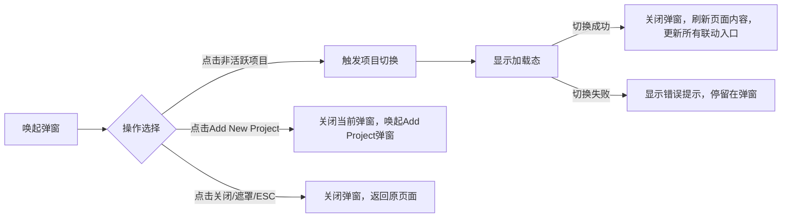
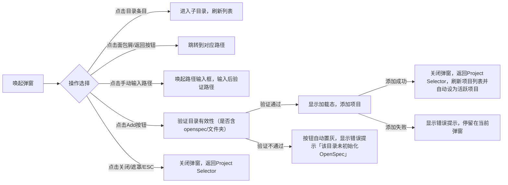

# Polaris Dashboard 最终落地规范
## 选型说明
正式选用**双层左侧侧边栏方案**，完整补全「一级全局功能切换栏 + 二级任务专属导航栏」双层导航结构。
整体架构、视觉样式、组件、交互**完全继承前期全局布局框架 + 视觉规范文档 + 任务模块规范**，仅新增外层一级导航栏，原有任务模块所有布局、功能、组件均不做修改，保证系统一致性与低改造成本。

---

## 一、整体全局布局架构（最终版）
### 1.1 整体结构示意图
```
┌─────────────────────────────────────────────────────────────────────┐
│  顶部导航栏 TopNavbar（固定高度 48px，--bg-sidebar）                 │
│ 左：Logo ｜ 中：项目标签区(仅任务页面显示) ｜ 右：首页/任务/设置按钮   │
├────────────┬───────────────────────────────────────────────────────┤
│  一级全局栏 │  ┌──────────────┬──────────────────────────────────┐ │
│  (固定64px)│  │ 二级任务导航栏 │  任务业务内容区（列表/详情）     │ │
│ 系统模块导航 │  │ (280px)  │  自适应宽度、垂直滚动            │ │
├────────────┼──┴──────────────┴──────────────────────────────────┘ │
│  底部状态栏 BottomStatusBar（固定高度 32px，--bg-sidebar）           │
└─────────────────────────────────────────────────────────────────────┘
```

### 1.2 全局外壳基础样式（沿用规范文档）
```css
/* 根容器：全屏垂直布局，页面整体外壳 */
.app-shell {
  display: flex;
  flex-direction: column;
  height: 100vh;
  overflow: hidden;
  background: var(--bg); /* #121212 主背景 */
}
/* 主体容器：顶部导航与底部状态栏之间，横向拆分一级侧边栏 + 内容容器 */
.main-container {
  display: flex;
  flex: 1;
  overflow: hidden;
}
/* 任务模块内容容器：横向拆分 二级任务导航栏 + 业务内容区 */
.task-container {
  display: flex;
  flex: 1;
  overflow: hidden;
}
```

### 1.3 全局区域基础参数表
| 区域 | 尺寸 | 背景色 | 边框规则 | 滚动规则 | 常驻范围 |
| ---- | ---- | ---- | ---- | ---- | ---- |
| 顶部导航栏 | 高 48px，通栏 | `--bg-sidebar`(#171717) | 底部 1px `--border` | 固定不滚动 | 全页面常驻 |
| 一级全局功能栏 | 宽64px | `--bg-sidebar`(#171717) | 右侧 1px `--border` | 整体固定，内部菜单可滚动 | 任务页面使用 |
| 二级任务导航栏 | 展开：宽200px<br/>折叠后隐藏 | `--surface`(#1E1E1E) | 右侧 1px `--border` | 内部列表可滚动 | 仅任务模块常驻 |
| 任务业务内容区 | 自适应剩余宽度 | `--bg`(#121212) | 无 | 垂直滚动 `overflow-y: auto` | 仅任务模块 |
| 底部状态栏 | 高 32px，通栏 | `--bg-sidebar`(#171717) | 顶部 1px `--border` | 固定不滚动 | 全页面常驻 |

### 1.4 通用模态基础规范（全局复用）

所有项目管理弹窗均遵循全局模态规则：

- 视觉：居中显示，半透明遮罩层（`rgba(0,0,0,0.6)`），弹窗背景`--surface`，圆角`--radius-lg`；
- 关闭规则：支持右上角 × 按钮、点击遮罩层、ESC 键关闭，关闭时自动丢弃未完成操作；
- 动效：弹窗淡入淡出（`0.15s ease`），遮罩同步过渡；
- 层级：`z-index: 300`，全局最高层级，覆盖所有页面元素。


---

## 二、各分区详细规范
### 2.1 顶部导航栏（全局复用，无修改）
#### 布局分区
1. **左侧**：品牌 Logo `>_ polaris`，`--font-mono` 字体、`--primary` 色，字号14px、字重700；
2. **中间**：项目标签区
   - 规则：**仅任务页面显示项目标签**，其余页面保留宽度、内容置空；
   - 样式：模拟浏览器标签，支持横向滚动，末尾固定「项目管理图标」；
3. **右侧**：导航按钮组（首页、任务、设置）
   - 样式：`padding: 6px 16px`，圆角 `--radius`；
   - 交互：hover 背景 `rgba(34, 197, 94, 0.1)`，active 背景 `rgba(34, 197, 94, 0.15)`、文字 `--primary`；
   - 过渡：`0.15s ease`。

> 核心联动：右侧按钮与**一级全局导航栏**状态双向同步。

---

### 2.2 一级功能切换栏
作用：负责当前项目下大模块切换。
#### 2.2.1 内部结构（从上、下两分区）
##### 1）上部：主菜单区（核心区域，自适应高度）
任务、规格、归档、检索、检测
- 区域宽度：64px，单菜单项尺寸：高 48px，左右内边距 `var(--space-md)`；**图标** 纵向排列；仅展示图标，鼠标指向图标时提示图标对应的名称；

##### 2）底部：辅助信息区

1. 项目设置

- 内容：设置图标按钮；
- 样式：图标尺寸20px，居中摆放，hover 背景 `rgba(34,197,94,0.1)`；
- 功能：点击后，弹出项目设置弹框。

2. 二级导航折叠或展开

* 内容：折叠/展开切换图标按钮；

* 样式：图标尺寸20px，居中摆放，hover 背景 `rgba(34,197,94,0.1)`；

* 功能：点击切换二级导航侧边栏宽度，**状态本地缓存**，刷新页面保留用户偏好。

#### 2.2.2 视觉样式（严格沿用全局 CSS 变量）
| 状态 | 样式规则 |
| ---- | ---- |
| 默认态 | 文字 `--text`，图标 `--text-secondary` |
| Hover 态 | 背景 `rgba(34,197,94,0.05)`，过渡 `0.15s ease` |
| Active/当前页面 | 左侧 3px 纯色边框 `--primary`，背景 `rgba(34,197,94,0.15)`，文字/图标 `--primary` |
| 圆角 | 菜单项整体圆角 `--radius`(6px) |

#### 2.2.3 核心交互规则
1. 点击菜单项 → 路由跳转至对应系统模块页面；
2. **双向状态同步**：一级导航菜单、顶部导航右侧按钮，**激活态同时高亮**；
3. 折叠/展开状态永久缓存，不随页面刷新重置。

---

### 2.3 二级任务专属导航栏
仅在**任务列表页、任务详情页**显示，负责**任务内部操作与任务列表切换**，宽度280px，可折叠。
从上至下分为5个固定区域：

#### 1）顶部快捷操作区
水平按钮组：`新变更`、`排序`、`刷新`

新变更：

- 样式：圆角 `--radius`，内边距 `6px 12px`，字号13px；靠左排列
- 交互：hover 背景加深，disabled 状态置灰禁用。

排序：

* 样式：切换图标按钮，支持按时间排列（由近到远排列）和按名称排列，点击后显示对应的图标

- 交互：待补充

刷新：

* 样式：图标按钮，点击后重新加载当前任务列表
* 交互：待补充

#### 2）列表
- 默认展开，条目包含：任务名称 + 创建时间 + 状态/进度徽章；
- 点击条目：切换右侧内容区为对应任务详情，当前条目高亮，卡片左侧显示绿色线条
- Hover：背景 `rgba(34, 197, 94, 0.05)`；
- 高亮态：左侧 2px `--primary` 边框，背景加深。

#### 3）底部汇总信息区
- 固定在栏底，展示当前任务数量
- 文字：字号12px，`--text-muted`。

---

### 2.4 底部状态栏（全局复用，无修改）
- 高度32px，通栏三等分布局（左/中/右）；
- 字体：11px，颜色 `--text-muted`；
- 用途：展示系统状态、操作反馈、版本、网络状态等全局信息。

---

## 三、任务模块页面布局规范
任务模块包含 **任务列表页**、**任务详情页** 两大核心页面，外层框架完全一致，仅右侧业务内容区差异化。

### 3.1 任务列表页（任务模块首页）
#### 右侧内容区结构
```
┌──────────────────────────────────────┐
│ 顶部筛选/搜索栏（固定高64px）          │
├──────────────────────────────────────┤
│ 任务卡片列表区（可垂直滚动）          │
├──────────────────────────────────────┤
│ 批量操作栏（选中任务后展示）          │
└──────────────────────────────────────┘
```
1. **筛选/搜索栏**：状态筛选器 + 关键词搜索框，样式对齐全局表单规范；
2. **任务卡片**：背景 `--surface`，圆角 `--radius-lg`；hover 边框 `--primary` + `--primary-glow` 发光；卡片内包含标题、状态徽章、进度条、时间、快捷操作；
3. **空状态**：居中占位提示 + 「新建任务」引导按钮；
4. **交互**：点击卡片进入任务详情页，支持多选、批量归档/删除（关键操作二次确认）。

### 3.2 任务详情页（核心业务页）
#### 右侧内容区三层固定结构
```
┌──────────────────────────────────────┐
│ 头部信息栏（固定高72px）              │
├──────────────────────────────────────┤
│ 任务流程可视化栏（固定高150px）            │
├──────────────────────────────────────┤
│ 标签页导航栏（固定高48px）            │
├──────────────────────────────────────┤
│ 多视图内容区（自适应、可滚动）        │
└──────────────────────────────────────┘
```
1. **头部信息栏**
   - 左侧：任务标题、创建时间、规格文档数量、工作流名称、任务总数及进展条
   
     任务标题单起一行，创建时间等信息在下面一行
   
     任务总数分为已完成任务数量/任务总数量，进度条显示进展量
   
   * 右侧：`执行`，`校验`，`检测`，`刷新`
   
     执行按钮用于在任务中断时继续拉起任务
   
     校验，用于对任务各工件及流程进行检查，确保任务执行是完整的
   
     检测用于对当前任务的工作内容进行检测和校验
   
     刷新，用于重新加载任务的信息及进展

2. **任务流程可视化栏**

   以流程图的形式展示任务流程各个节点的信息及进展状态，流程图显示方向为水平向右

3. **标签页导航**

- 标签：`提案`、`设计`、`任务`、`规格差异`、`其他`，附带数量徽章；
- 点击切换视图，激活态高亮；

1. **内容区**

   - 视图：结构化 Markdown 内容渲染；

   - 设计：采用左、右结构显示，左侧列出文件列表，显示文件名。

     ​	   点击文件名后，右侧显示对应文件的内容，以Markdown内容渲染

   - Spec Deltas 视图：差异对比列表/表格；

     ​	采用左、右结构显示，左侧列出文件列表，显示文件名。

     ​       点击文件名后，右侧显示对应文件的内容，以Markdown内容渲染

   - Other 视图：附件、日志、评论列表；

   ​	采用左、右结构显示，左侧列出文件列表，显示文件名。

   ​        点击文件名后，右侧显示对应文件的内容，以Markdown内容渲染

   - 统一容器：背景 `--surface`，内边距 `var(--space-xl)`。

---

## 四、项目管理规范

### 4.1 项目标签

#### 4.1.1 总体说明

##### 1. 整体结构示意图

```
[Logo] ─── [项目标签1] [项目标签2] [项目标签3] ··· [管理图标] ─── [首页 任务 设置]
```

整体分为两部分：**可滚动项目标签组** + **常驻项目管理图标**

##### 2. 区域基础尺寸与样式

1. 标签区整体：自适应中间剩余宽度，内部横向排列，内容溢出时开启**横向滚动**；
2. 单个项目标签：
   - 高度：与导航栏等高（48px），最小宽度 `80px`，最大宽度 `180px`；
   - 内边距：左右 `var(--space-md)`；
   - 圆角：`--radius` (6px)；
   - 布局：内部 = 项目名称文本 + 右侧「关闭按钮(×)」。

##### 3. 标签多状态视觉样式（沿用全局色彩）

| 状态                   | 背景色                  | 文字色                 | 边框                                   | 附加样式                   |
| ---------------------- | ----------------------- | ---------------------- | -------------------------------------- | -------------------------- |
| 默认未激活             | `--muted`               | `--text-secondary`     | 透明                                   | 常规展示                   |
| Hover 悬浮             | `rgba(34,197,94,0.1)`  | `--text`               | `1px solid var(--primary)`             | 轻微边框高亮               |
| 激活选中（当前项目）   | `rgba(34,197,94,0.15)` | `--primary`            | `1px solid var(--primary-glow-strong)` | 核心高亮，标识当前生效项目 |
| 失效标签（项目已删除） | `--bg`                  | `--text-muted`（置灰） | 透明                                   | 禁止点击切换               |

##### 4. 子元素样式

1. **标签关闭按钮（×）**
   - 尺寸：16px，居标签右侧；
   - 默认：透明背景，`--text-muted`；
   - Hover：背景 `--error`，文字白色，点击触发关闭；
2. **项目管理图标（标签组末尾常驻）**
   - 位置：标签区**最右端固定**，**不随标签滚动**，永久可见；
   - 图标样式：尺寸20px，默认 `--text-secondary`；
   - Hover：颜色变为 `--primary`，背景轻微提亮。

##### 5. 滚动指示器（标签溢出时出现）

标签数量过多、横向宽度不足时，标签区左右两侧自动显示**左右滚动箭头**：

- 样式：图标 `--text-secondary`，hover 变 `--primary`；
- 位置：吸附在标签区左右边缘，标签未溢出时自动隐藏。

---

#### 4.1.2 核心交互规则（任务页标签区全场景）

##### 1 标签基础切换交互

1. **点击未激活标签**
   - 行为：将当前标签置为**激活态**；
   - 联动：
     ① 刷新任务页面全量内容（二级任务导航、活动变更、任务列表、详情）；
     ② 同步更新二级任务导航栏底部「当前项目」信息；
     ③ 本地存储更新「当前激活项目」；
   - 反馈：切换过程中标签显示**加载动画**，禁止重复点击；切换成功/失败弹出全局 Toast。

2. **点击已激活标签**
   - 行为：无切换动作，仅保留激活样式；
   - 扩展：双击激活标签 → 刷新当前项目所有任务数据。

##### 2 标签关闭交互（点击标签内 × 按钮）

1. **常规关闭（非最后一个标签）**
   - 行为：移除当前标签；
   - 联动：
     ① 若关闭的是**激活标签**，自动将**左侧相邻标签**设为新激活标签，并同步刷新页面；
     ② 本地存储同步删除该标签记录；
2. **关闭最后一个标签**
   - 行为：标签区保留空白，弹出提示「已关闭所有项目标签」；
   - 联动：任务页面保留最后一个项目上下文，不自动切项目；可通过「项目管理图标」重新打开项目；
3. **失效标签关闭**
   - 点击失效标签关闭按钮：直接移除标签，无额外校验。

##### 3 标签滚动交互（标签溢出场景）

当标签总宽度超出标签区可视宽度时启用：

1. **点击左右滚动箭头**：单次点击滚动一整个标签宽度；长按连续滚动；
2. **鼠标操作**：支持**鼠标横向拖拽**标签组、鼠标滚轮横向滚动；
3. **滚动记忆**：滚动位置存入本地缓存，刷新页面后恢复上次滚动位置。

##### 4 项目管理图标 交互（标签区末尾常驻图标）

1. 触发动作：点击图标 → 全局唤起 `项目选择器` 弹窗（与二级导航底部项目入口**完全同源**）；
2. 关闭规则：遵循全局模态弹窗规范（关闭按钮/遮罩/ESC 均可关闭）；
3. 联动规则：详见下文「四、全链路状态联动」。

##### 5 标签新建规则（自动创建逻辑）

1. **触发新建场景**
   - 通过「项目选择器」打开**未存在标签**的项目 → 自动在标签组末尾新增对应项目标签，并设为激活态；
   - 进入新项目任务页面 → 自动创建标签；
2. **去重规则**
   - 若项目标签已存在，**不重复新建**，直接激活已有标签。

#### 4.1.3 特殊状态&异常场景处理

##### 5.1 空标签状态（无任何项目标签）

1. 视觉：标签区空白，仅保留**项目管理图标**；
2. 交互：无法切换标签，仅可通过管理图标打开项目选择器；
3. 提示：hover 空白区域显示浮窗提示「暂无项目标签，点击右侧图标管理项目」。

##### 5.2 失效标签（项目已被删除/目录不存在）

1. 视觉：标签文字置灰，取消高亮样式；
2. 点击切换：弹出 Toast 提示「该项目已不存在，请关闭标签后重新添加」；
3. 保留逻辑：不自动删除失效标签，由用户手动关闭。

##### 5.3 切换加载异常

1. 网络/接口超时：标签加载动画停留 2s 后消失，弹出错误提示「项目加载失败，请重试」；
2. 权限不足：提示「无权限访问该项目」，标签保持原激活状态。

---

#### 4.1.4 响应式适配（沿用全局三段断点）

结合屏幕宽度，对标签区做自适应调整：

| 屏幕断点               | 标签区适配规则                                               |
| ---------------------- | ------------------------------------------------------------ |
| ≥1024px（大屏）        | 标签区完整展示，溢出时显示左右滚动箭头；标签宽高保持默认尺寸 |
| 768px ~ 1023px（中屏） | 单个标签最大宽度缩小至 140px，标签内文字自动省略；滚动箭头缩小尺寸 |
| ＜768px（移动端/窄屏） | 1. 标签区大幅压缩，仅显示**激活标签**+管理图标；<br>2. 隐藏所有非激活标签；<br>3. 点击激活标签 → 弹出标签下拉面板，展示全部标签列表；<br>4. 关闭按钮移入下拉面板内 |

> 补充：移动端下，项目管理图标仍固定在标签区最右侧，功能不变。

---

#### 4.1.5 键盘交互 & 无障碍规范

##### 1 键盘快捷键（全局统一）

1. `Tab / Shift+Tab`：按顺序在「Logo → 标签组 → 管理图标 → 右侧功能按钮」之间切换焦点；
2. 焦点落在标签上：
   - `Enter`：切换为激活标签；
   - `Delete`：快速关闭当前标签；
   - `← / →` 方向键：在多个标签之间切换焦点；
3. 焦点落在**项目管理图标**：`Enter` 唤起项目选择器弹窗；
4. `ESC`：关闭弹窗、取消标签焦点。

##### 2 无障碍属性（兼容屏幕阅读器）

1. 单个标签：
   - `aria-label="切换至【项目名】"`
   - 激活标签：`aria-selected="true"`，未激活：`aria-selected="false"`；
2. 标签关闭按钮：`aria-label="关闭【项目名】标签"`；
3. 项目管理图标：`aria-label="打开项目管理列表"`；
4. 滚动箭头：`aria-label="向左滚动标签"` / `aria-label="向右滚动标签"`。

### 4.2 项目管理

#### 4.2.1 项目列表

##### 1.  布局

项目列表分为3个功能区：

```
┌─────────────────────────────────────────┐
│ 头部区：标题+说明文字+关闭按钮           │
├─────────────────────────────────────────┤
│ 项目列表区：标题+项目条目（含状态徽章）    │
├─────────────────────────────────────────┤
│ 底部操作区：Add New Project 按钮        │
└─────────────────────────────────────────┘
```
| 区域       | 元素详情                                                     | 视觉规范                                                     |
| ---------- | ------------------------------------------------------------ | ------------------------------------------------------------ |
| 头部区     | 文件夹图标（`--primary`色）、标题`项目选择器`、说明文字「切换到其他项目或添加新项目」、右上角关闭× | 标题字号18px，字重600；说明文字字号14px，`--text-muted`；关闭按钮hover背景加深 |
| 项目列表区 | 标题`项目`、项目条目（文件夹图标+项目名称/别名+路径+状态徽章） | 项目名称字号16px，路径字号12px`--text-muted`；`Active`状态徽章为蓝色背景，带对勾图标 |
| 底部操作区 | 带加号图标的 `添加新项目`按钮，居中显示                      | 主按钮样式，背景`--primary`，hover加深10%                    |

##### 2. 核心交互流程


##### 3. 状态与交互规则
| 状态               | 交互规则                                           | 视觉表现                                                     |
| ------------------ | -------------------------------------------------- | ------------------------------------------------------------ |
| 活跃项目（Active） | 不可点击，禁止重复切换；条目为当前选中态，高亮显示 | 条目背景`rgba(34,197,94,0.1)`，左侧带2px`--primary`边框，右侧显示蓝色`Active`徽章 |
| 未活跃项目         | 点击触发项目切换，支持hover预览                    | 条目默认背景，hover背景`rgba(34,197,94,0.05)`，过渡`0.15s ease` |
| 加载态             | 项目切换中，条目置灰，显示加载图标，禁止重复点击   | 条目透明度0.7，右侧显示加载动画                              |
| 空状态             | 项目列表为空时，显示占位提示+引导添加按钮          | 居中显示「暂无项目，请添加新的Polaris项目」，按钮直接唤起`新增项目`弹窗 |

##### 4. 键盘与无障碍规则
- 支持Tab/Shift+Tab切换焦点，Enter键触发项目切换/唤起添加弹窗；
- 弹窗打开时，焦点自动定位到第一个非活跃项目条目；
- 所有元素添加`aria-label`，状态变化同步更新`aria-selected`属性；
- 屏幕阅读器可识别项目名称、路径、活跃状态。

---

#### 4.2.2：添加项目
##### 1. 布局结构拆解
完全复用你提供的界面结构，分为5个功能区：
```
┌─────────────────────────────────────────┐
│ 头部区：图标+标题+说明文字+关闭按钮        │
├─────────────────────────────────────────┤
│ 提示说明区：初始化引导+文档链接            │
├─────────────────────────────────────────┤
│ 路径导航区：面包屑+返回/根目录按钮         │
├─────────────────────────────────────────┤
│ 目录浏览区：文件夹列表（可点击进入子目录）  │
├─────────────────────────────────────────┤
│ 底部操作区：当前路径+Add按钮+手动输入入口 │
└─────────────────────────────────────────┘
```
| 区域       | 元素详情                                                     | 视觉规范                                                     |
| ---------- | ------------------------------------------------------------ | ------------------------------------------------------------ |
| 头部区     | 加号图标、标题`添加项目`、说明文字「浏览已经包含openspec/文件夹的仓库」、右上角关闭× | 标题字号18px，字重600；说明文字字号14px`--text-muted`        |
| 提示说明区 | 文字说明「需要新项目？请先安装OpenSpec，并在仓库中运行openspec init」+「安装OpenSpec」「CLI设置指南」链接 | 背景`--bg`，链接下划线，hover高亮为`--primary`               |
| 路径导航区 | 面包屑路径、返回上一级/根目录按钮                            | 面包屑可点击，hover高亮；按钮图标20px，hover背景加深         |
| 目录浏览区 | 垂直列表，每个条目为文件夹图标+名称+展开箭头                 | 条目hover背景`rgba(34,197,94,0.05)`，选中态背景`rgba(34,197,94,0.1)` |
| 底部操作区 | 当前选中路径显示、`添加此目录`按钮、「或手动输入路径」入口   | 按钮为`--primary`主按钮，路径文字12px`--text-muted`，手动输入入口hover高亮 |

##### 2. 核心交互流程


##### 3. 关键交互规则
1.  **目录有效性校验**：仅允许添加包含`openspec/`文件夹的目录，未初始化的目录按钮自动置灰，禁止添加；
2.  **路径导航限制**：禁止跳出用户主目录/系统受限目录，防止安全风险；
3.  **手动路径校验**：支持绝对/相对路径输入，输入后自动验证格式与目录有效性；
4.  **状态同步**：添加成功后，新项目自动设为活跃项目，同步更新所有联动入口。

##### 4. 状态与视觉规范
| 状态       | 交互规则                                                     | 视觉表现                                          |
| ---------- | ------------------------------------------------------------ | ------------------------------------------------- |
| 目录浏览态 | 支持点击进入子目录，上下箭头导航列表                         | 条目hover背景高亮，选中态左侧带2px`--primary`边框 |
| 验证中     | 点击Add按钮后，显示加载态，禁止重复点击                      | 按钮置灰并显示加载图标，条目列表不可点击          |
| 错误态     | 路径无效/无openspec文件夹时，显示对应错误提示                | 弹窗内显示`--error`色文字提示，按钮保持置灰       |
| 成功态     | 添加完成后，自动关闭弹窗，无额外提示（由Project Selector同步状态） | 按钮显示成功图标，1s后关闭弹窗                    |

##### 5. 键盘与无障碍规则
- 支持上下箭头导航目录列表，Enter键进入目录/添加项目；
- Tab/Shift+Tab切换焦点，ESC键关闭弹窗；
- 弹窗打开时，焦点自动定位到目录列表的第一个条目；
- 所有路径、按钮添加`aria-label`，错误提示同步更新`aria-invalid`属性。

---

# 五、Dashboard功能

- ✅ **仪表盘页面（路由 `#/dashboard`）**：强制使用**专属布局**，**无任何左侧侧边栏**（一级全局导航、二级任务导航全部移除），最大化内容展示区域；

### 一、整体说明

#### 1.1 整体结构示意图

```
┌─────────────────────────────────────────────────────────────────────┐
│  顶部导航栏 TopNavbar (固定高度 48px，--bg-sidebar)                 │
│ 左：Logo ｜ 中：空白占位 ｜ 右：首页 / 任务 / 设置 功能按钮组        │
├─────────────────────────────────────────────────────────────────────┤
│                                                                     │
│                仪表盘主内容区（自适应宽高、纵向滚动）                 │
│                整体最大宽度 900px，水平居中                          │
│                                                                     │
├─────────────────────────────────────────────────────────────────────┤
│  底部状态栏 BottomStatusBar (固定高度 32px，--bg-sidebar)           │
└─────────────────────────────────────────────────────────────────────┘
```

#### 1.2 全局区域基础参数表

| 区域           | 固定尺寸              | 背景色                   | 边框规则            | 滚动特性                    | 布局特性                           |
| -------------- | --------------------- | ------------------------ | ------------------- | --------------------------- | ---------------------------------- |
| 顶部导航栏     | 高度 `48px`，通栏全屏 | `--bg-sidebar` (#171717) | 底部 1px `--border` | 固定不滚动                  | 全局通栏，三栏等分布局             |
| 仪表盘主内容区 | 自适应剩余宽高        | `--bg` (#121212)         | 无                  | `overflow-y: auto` 纵向滚动 | 内容整体最大宽度 `900px`，水平居中 |
| 底部状态栏     | 高度 `32px`，通栏全屏 | `--bg-sidebar` (#171717) | 顶部 1px `--border` | 固定不滚动                  | 三等分布局，全局状态展示           |

#### 1.3 通用基础约束

1. 间距、圆角、字体、色彩严格使用全局 CSS 变量（`--space-*` / `--radius-*` / 语义色系列）；
2. 所有可交互元素过渡动效：`0.15s ease`，系统开启`prefers-reduced-motion: reduce`时关闭全部动画；
3. 所有组件（卡片、按钮、徽章、进度条、折叠面板）复用全局公共组件。

---

### 二、分区详细布局与交互规范

#### 2.1 顶部导航栏（仪表盘页面专属规则）

##### 2.1.1 三栏分区定义

1. **左侧：品牌 Logo**
   - 内容：`>_ polaris`，字体 `--font-mono`，字号14px、字重700、颜色`--primary`；
   - 交互：点击 Logo 停留在当前仪表盘页面，无跳转；
   - 状态：静态展示，无 hover 特殊样式。

2. **中间区域**
   - 规则：遵循全局统一约定，**非任务页面永久空白占位**，不渲染项目标签、管理图标。

3. **右侧：功能按钮组（首页 / 任务 / 设置）**
   - 样式：按钮内边距 `6px 16px`，圆角 `--radius`；
   - 状态样式（全局统一）：
     - 默认态：文字 `--text-secondary`；
     - Hover：背景 `rgba(34, 197, 94, 0.1)`；
     - Active（当前页）：背景 `rgba(34, 197, 94, 0.15)`，文字 `--primary`；
   - 跳转交互：
     - 「首页」：当前页面，固定高亮，点击无动作；
     - 「任务」：点击跳转至**任务管理页面**（自动加载通用双层侧边栏布局）；
     - 「设置」：点击跳转至**系统设置页面**（自动加载通用双层侧边栏布局）。

##### 2.1.2 联动规则

页面路由与按钮激活态双向绑定，切换页面后自动刷新按钮高亮状态。

---

#### 2.2 主内容区（核心业务区域）

整体约束：内容最大宽度 `900px`、水平居中，模块之间间距使用 `--space-xl`；从上至下分为 **5 个固定模块**，顺序不可调整。

##### 模块1：页面头部（项目信息区）

元素构成：项目图标 + 项目名称（当前活跃项目）+ Web/CLI 版本信息

视觉规范：

- 项目名称：`h1` 层级，字号1.5rem、字重700、颜色`--text`；
- 版本信息：辅助文字，字号12px、颜色`--text-muted`；
- 图标尺寸：24px，默认`--text-secondary`。

交互规则

1. **项目图标 + 项目名称（项目管理唯一入口）**
   - 触发行为：点击任意区域 → 唤起 `Project Selector 项目选择器` 模态弹窗；
   - 视觉反馈：hover 时图标+文字变为 `--primary`，提示可点击；
2. **版本信息**
   - 触发行为：点击版本文字 → 跳转至「设置页-版本模块」，顶部导航「设置」按钮同步高亮；
   - 视觉反馈：hover 文字高亮+下划线；
3. **状态同步**：切换项目后，图标、名称自动刷新为最新活跃项目。

---

##### 模块2：统计卡片组（全局概览）

元素构成

5 张统计卡片：`项目`/`进行中` / `已归档` / `规格` / `验证` / `任务数`

​	项目：纳管的项目总数

​	进行中：进行中的Change

​	已归档：已归档的Change

  	 规格：规格总数

   	验证：

​	任务数：总任务数，显示任务进度

布局规则（响应式）

- ≥1024px（大屏）：4 列 Grid 布局，卡片间距 `--space-lg`；
- 768px ~ 1023px（中屏）：自动改为 2 列；
- ＜768px（移动端）：保持 2 列，卡片内边距小幅收紧。

视觉规范（复用全局 `.stat-card`）

- 卡片背景：`--surface`，圆角 `--radius-lg`；
- 数值：`.stat-value` 样式，28px、字重700、`--font-mono`；
- 标签文字：13px、`--text-secondary`；
- Hover 效果：边框变为 `--primary` + 投影 `--primary-glow`。

交互规则

1. **数据与状态联动**
   - 进度条配色遵循全局语义规则：＜50% = `--error`、50%~99% = `--warning`、100% = `--success`；
   - 项目切换、任务状态变更后，卡片数值、进度、状态**自动实时刷新**；
2. **空状态**：无数据时展示全局空状态组件，保留跳转功能。

---

##### 模块3：活动变更列表

元素构成：模块标题（`h2` 层级）+ 顶部快捷操作按钮组 + 变更条目列表

视觉规范

- 标题：1.25rem、字重600、`--text`；
- 列表条目：背景透明，hover 背景 `rgba(34, 197, 94, 0.05)`；
- 状态徽章、进度条、标签：复用全局 `.badge`、`.mini-progress` 组件样式。

交互规则

1. 变更条目**
   - 点击条目/标题 → 跳转至对应**任务详情页**，顶部导航「任务」自动高亮；
   - 条目内操作按钮、状态标签交互逻辑与任务模块统一；
3. **列表刷新**：项目切换、操作完成后自动刷新，支持手动刷新。

---

##### 模块4：最近活动

元素构成：网格布局条目：变更标题、操作时间、状态图标

布局规则

- 大屏多列排布，条目溢出区域支持**横向滚动**；
- 中小屏自动缩为单列。

交互规则

1. 点击任意条目 → 跳转至对应任务详情页；
2. 默认排序：**时间倒序**（最新操作置顶）；
3. 状态图标配色：严格遵循全局语义色（`--success`/`--warning`/`--error`/`--accent`）；
4. Hover 视觉反馈与全局列表组件统一。

---

##### 模块5：规划上下文（折叠面板组）

元素构成：模块标题 + `Focus section` 聚焦按钮 + 多组折叠规则面板

视觉规范

- 面板容器：背景`--surface`，圆角`--radius-lg`；
- 面板标题：`h3` 层级，1.1rem、字重600；
- 规则文本：正文14px，代码/路径使用 `--font-mono`。

交互规则

1. **折叠/展开**：点击面板标题切换状态，过渡动画 `0.15s ease`；
2. **Focus section 聚焦按钮**：点击后仅保留当前面板，隐藏其余所有面板；
3. **文本操作**：规则文本 hover 唤起「复制」按钮，支持一键复制；
4. **数据同步**：项目配置文件修改后，面板内容自动刷新。

---

#### 2.3 底部状态栏（全局完全复用）

1. 布局：通栏三等分（左/中/右），无结构修改；
2. 文字规范：字号11px、颜色`--text-muted`；
3. 功能：展示系统版本、网络状态、操作结果、加载提示等全局信息；
4. 交互：纯静态展示，无点击操作。

# 六、全局配置

## 1. 设置页整体布局架构

### 1.1 结构示意图

```
┌─────────────────────────────────────────────────────────────────────┐
│  顶部导航栏 TopNavbar (固定高度 48px，--bg-sidebar)                 │
│ 左：Logo ｜ 中：空白占位 ｜ 右：首页 / 任务 / 设置（当前「设置」高亮） │
├─────────────────────────────────────────────────────────────────────┤
│                                                                     │
│                设置页主内容区（自适应宽高、纵向滚动）                 │
│                主内容区内为「二级设置菜单 + 右侧内容区」双栏布局       │
│                                                                     │
├─────────────────────────────────────────────────────────────────────┤
│  底部状态栏 BottomStatusBar (固定高度 32px，--bg-sidebar)           │
└─────────────────────────────────────────────────────────────────────┘
```

### 1.2 全局区域基础参数表

| 区域           | 固定尺寸              | 背景色                   | 边框规则            | 滚动特性                    | 布局特性                                      |
| -------------- | --------------------- | ------------------------ | ------------------- | --------------------------- | --------------------------------------------- |
| 顶部导航栏     | 高度 `48px`，通栏全屏 | `--bg-sidebar` (#171717) | 底部 1px `--border` | 固定不滚动                  | 全局通栏，三栏等分布局                        |
| 设置页主内容区 | 自适应剩余宽高        | `--bg` (#121212)         | 无                  | `overflow-y: auto` 纵向滚动 | 整体最大宽度 `1000px`，水平居中；内部双栏布局 |
| 底部状态栏     | 高度 `32px`，通栏全屏 | `--bg-sidebar` (#171717) | 顶部 1px `--border` | 固定不滚动                  | 三等分布局，全局状态展示                      |

---

## 2、分区详细布局与交互规范

### 2.1 顶部导航栏（设置页专属规则）

与仪表盘页面保持完全一致，仅状态高亮适配：

1.  **左侧品牌Logo**：`>_ polaris`，点击停留在当前设置页，无跳转；
2.  **中间区域**：遵循全局约定，**非任务页面永久空白占位**，不渲染项目标签与管理图标；
3.  **右侧功能按钮组**：「首页/任务/设置」，当前页为设置页时，**「设置」按钮默认激活高亮**；
    - 点击「首页」：跳转至仪表盘专属布局；
    - 点击「任务」：跳转至任务管理通用布局，自动加载双层侧边栏；
    - 样式、hover/active状态、过渡动效完全沿用全局导航按钮规范。

---

### 2.2 主内容区（核心双栏布局）

整体约束：内容最大宽度 `1000px`、水平居中，模块间距使用全局 `--space-xl` 变量，内部采用「左侧设置菜单 + 右侧内容区」双栏布局，结构与你提供的截图完全对齐。

#### 2.2.1 左侧二级设置菜单

#### 元素构成

垂直排列的设置模块菜单，从上到下依次为：`General 常规设置` / `Workflow 工作流` / `Commands 命令` / `Validation 验证` / `Versions 版本`，每个菜单项为「图标+文字」组合。

#### 视觉规范

- 固定宽度：`200px`，背景 `--surface`；
- 菜单项高度：`48px`，内边距 `--space-md`；
- 状态样式（与全局导航规范对齐）：
  - 默认态：文字 `--text-secondary`，图标 `--text-muted`；
  - Hover态：背景 `rgba(34,197,94,0.05)`；
  - Active/选中态：左侧 3px `--primary` 边框，文字/图标变为 `--primary`，背景 `rgba(34,197,94,0.1)`。

#### 交互规则

- 点击任意菜单项：右侧内容区切换为对应设置模块，菜单项同步高亮；
- 菜单固定在主内容区左侧，不随内容滚动，方便快速切换模块；
- 项目切换后，菜单状态保持不变，仅右侧内容区刷新为当前项目配置。

---

#### 2.2.2 右侧设置内容区（自适应宽度）

根据左侧选中的菜单，切换对应设置模块内容，所有表单组件、卡片、交互完全复用全局公共组件，分模块规范如下：

#### 模块1：General 常规设置

##### 元素构成

- 主题选择（`Light`/`Dark`/`System` 单选按钮组）；
- 语言选择（下拉选择器，当前为「简体中文」）；
- 资源管理器设置（`Enable preview tabs` 复选框 + 说明文字）。

##### 交互规范

- 主题选择：点击单选按钮即时生效，整个系统主题同步切换，无刷新等待；
- 语言选择：下拉选择后即时生效，界面语言同步更新；
- 复选框：勾选/取消勾选即时保存配置，显示全局Toast提示；
- 组件样式：单选、下拉、复选框完全沿用全局表单组件规范。

#### 模块2：Workflow 工作流

##### 元素构成

- 工作流格式选择（`Standard`/`Claude Code`/`Skill` 单选按钮组）；
- 工作流命令示例文本（`Workspace`/`Change` 命令示例）；
- 参考文档链接（`OpenSpec 文档`/`Supported Tools 支持的工具`）。

##### 交互规范

- 格式选择：点击单选按钮即时保存配置，修改后自动同步到项目配置文件；
- 命令示例：hover 唤起「复制」按钮，支持一键复制命令；
- 文档链接：点击跳转至外部文档页面，打开新标签页。

#### 模块3：Commands 命令

##### 元素构成

- 模块说明文字；
- `Core Commands 核心命令` 分组：`Propose`/`Explore`/`Apply`/`Sync`/`Archive` 复选框列表；
- `Expanded Commands 扩展命令` 分组：`New`/`Continue`/`Fast Forward`/`Verify`/`Bulk Archive` 复选框列表；
- 本地配置说明文字。

##### 交互规范

- 复选框勾选/取消：即时保存配置，修改后同步更新任务模块的命令可用性；
- 命令说明文字：hover 显示完整提示信息；
- 组件样式：复选框、分组标题完全沿用全局表单规范。

#### 模块4：Validation 验证

##### 元素构成

- 模块说明文字；
- 验证配置选项：`严格`/`自动运行`/`工件变更时自动运行` 复选框；
- `并发数` 输入框；
- `命令预览` 文本框（显示验证命令示例）。

##### 交互规范

- 复选框/输入框修改：即时保存配置，修改后自动更新验证模块的运行规则；
- 命令预览：hover 唤起「复制」按钮，支持一键复制命令；
- 输入框校验：并发数仅允许输入正整数，格式错误时显示内联错误提示。

#### 模块5：Versions 版本

##### 元素构成

- 模块说明文字；
- `OpenSpec WebUI` 版本卡片：当前版本/最新版本/状态/更新命令；
- `OpenSpec CLI` 版本卡片：当前版本/最新版本/状态/更新命令；
- 更新后操作说明文字 + 项目更新命令示例。

##### 交互规范

- 版本状态：自动检测最新版本，显示「已是最新版本」或「有更新」提示；
- 更新命令：hover 唤起「复制」按钮，支持一键复制命令；
- `Releases 版本` 链接：点击跳转至版本发布页面；
- 项目更新命令：hover 唤起「复制」按钮，支持一键复制。

---

#### 2.3 底部状态栏（全局完全复用）

与仪表盘页面保持完全一致，无任何修改：

- 布局：通栏三等分（左/中/右）；
- 文字规范：字号11px、颜色`--text-muted`；
- 功能：展示系统版本、网络状态、操作结果、加载提示等全局信息。

---

## 3、项目管理弹窗 交互规范（设置页专属入口）

设置页无一级导航、无顶部项目标签区，项目切换入口与截图对齐，统一为以下方式：

#### 3.1 唤起入口（设置页专属）

- 唯一入口：主内容区左下角的 `CURRENT PROJECT 当前项目` 信息区（项目图标+项目名称+项目路径）；
- 交互：点击任意区域 → 唤起 `Project Selector 项目选择器` 模态弹窗；
- 视觉反馈：hover 时图标+文字变为 `--primary`，提示可点击。

#### 3.2 弹窗流转与同步规则

弹窗样式、流转逻辑、异常处理完全沿用全局项目管理规范：

1.  项目切换/新增成功后，以下内容强制同步更新：
    - 设置页的所有配置内容，刷新为当前项目的配置；
    - 页面左下角的项目信息；
    - 本地存储的活跃项目状态，刷新页面不丢失；
    - 切换至任务/仪表盘页面时，自动加载新活跃项目数据。
2.  关闭方式：右上角关闭按钮、点击遮罩区域、键盘 `ESC` 键；
3.  层级：`z-index: 300`，全局最高层级。

---

## 4、跨模块联动与状态同步

#### 4.1 从设置页向外跳转

| 触发位置                | 目标页面     | 布局变化                 | 状态联动                           |
| ----------------------- | ------------ | ------------------------ | ---------------------------------- |
| 顶部导航「首页」        | 仪表盘页面   | 切换为仪表盘专属布局     | 按钮「首页」同步高亮               |
| 顶部导航「任务」        | 任务管理页   | 切换为通用双层侧边栏布局 | 一级导航、顶部按钮「任务」同步高亮 |
| 工作流/验证模块文档链接 | 外部文档页面 | 打开新标签页             | 无状态联动                         |

#### 4.2 从其他页面跳回设置页

1.  通用页面顶部导航：点击「设置」按钮 → 返回设置页专属布局；
2.  通用页面一级全局导航：点击「设置」菜单 → 返回设置页专属布局。

#### 4.3 核心联动规则

1.  活跃项目全局唯一，设置页的配置修改与项目绑定，切换项目后配置自动刷新；
2.  主题、语言等全局设置修改后，整个系统所有页面即时生效；
3.  工作流、命令、验证等项目级设置修改后，自动同步到项目配置文件，任务模块实时生效。

---

## 5、全场景状态与反馈规范

### 5.1 加载态

1.  页面首次加载、切换项目：展示全局骨架屏；
2.  版本检测、配置保存时：按钮置灰 + 加载动画，禁止重复点击。

#### 5.2 错误态

1.  配置保存失败：显示 `--error` 色错误提示 + 「重试」按钮；
2.  项目切换失败：引导至项目管理弹窗；
3.  输入框格式错误：显示内联错误提示，按钮置灰。

#### 5.3 操作反馈

所有配置修改、项目切换、版本检测操作，成功/失败均使用**全局 Toast 提示**，区分不同场景的提示文案。

#### 5.4 空状态

无项目配置、无版本信息时，使用全局空状态组件，附带引导操作按钮。

---

## 6、响应式适配规则（与仪表盘对齐）

| 屏幕断点               | 布局适配细节                                                 |
| ---------------------- | ------------------------------------------------------------ |
| ≥1024px（大屏桌面）    | 内容最大宽度1000px居中；双栏布局完整展示，菜单固定在左侧；所有模块按原设计显示 |
| 768px ~ 1023px（中屏） | 内容最大宽度自适应；二级设置菜单宽度小幅收紧，组件间距调整；内容区保持不变 |
| ＜768px（移动端/窄屏） | 双栏布局改为「抽屉式菜单 + 全屏内容区」：点击左上角按钮唤起二级设置菜单；菜单为全屏抽屉样式；设置内容全屏展示；弹窗全屏适配 |

---

## 7、键盘交互与无障碍规范

1.  焦点切换：`Tab / Shift+Tab` 顺序切换页面内所有可交互元素（菜单、表单、按钮、链接）；
2.  触发操作：`Enter` 键执行菜单切换、表单提交、按钮点击动作；
3.  弹窗关闭：全局统一 `ESC` 键关闭模态弹窗；
4.  无障碍属性：所有交互元素配置 `aria-label` / `aria-selected` / `aria-expanded`，兼容屏幕阅读器；
5.  页面初始焦点：页面加载完成后，焦点自动定位到当前选中的设置菜单项。

# 七、视觉与组件规范（全系统统一）

全部沿用 `dashboard-visual-spec.md` 设计变量，双层导航、任务组件无新增硬编码样式：
1. **色彩体系**：主色、语义色、背景/文字色、发光色严格使用全局 CSS 变量；
2. **字体层级**：Logo、标题、正文、辅助文字、代码字体完全遵循字体层级表；
3. **圆角阶梯**：导航项、按钮、卡片、徽章统一使用 `--radius-sm` / `--radius` / `--radius-lg`；
4. **间距阶梯**：所有内边距、组件间距使用 `--space-xs` ~ `--space-3xl` 系列变量；
5. **通用组件**：按钮、卡片、徽章、进度条、模态框、骨架屏、空状态样式全局复用。

---

# 八、响应式适配规则（按文档断点执行）
## 断点1：≥1024px（大屏，桌面端默认）
- 一级全局栏：固定展开（48px，图标）；
- 二级任务栏：完整展开（280px）；
- 首页统计卡片：4 列布局；步骤进度组件全尺寸展示。

## 断点2：768px ~ 1023px（中屏）
- 一级全局栏：默认折叠（64px，仅图标），支持手动展开；
- 二级任务栏：保持 280px 固定宽度；
- 首页统计卡片：4列 → 2列；步骤组件尺寸、内边距收紧。

## 断点3：＜768px（小屏/移动端）
- 一级全局栏、二级任务栏 **全部转为抽屉弹窗**，点击顶部图标唤起；
- 侧边栏默认隐藏，内容区占满全屏；
- 表格、辅助文字字号缩小；步骤进度组件支持横向滚动。

---

# 九、图层深度（z-index 层级，杜绝层叠冲突）
| z-index | 对应元素 | 说明 |
| ---- | ---- | ---- |
| 100 | 顶部导航栏、一级全局侧边栏 | 全局顶层固定元素 |
| 90 | 二级任务专属导航栏 | 低于一级栏，高于业务内容 |
| 80 | 页面业务内容、常规组件 | 基础内容层级 |
| 300 | 模态框、下拉菜单、弹窗 | 全局最高层级，覆盖所有元素 |

---

# 十、动效、交互与无障碍规范
1. **过渡动效**：所有 hover、点击、切换、折叠动效统一 `0.15s ease`；
2. **动效降级**：系统开启 `prefers-reduced-motion: reduce` 时，关闭全部动画；
3. **键盘导航**：侧边栏菜单项、按钮支持 Tab 聚焦，满足无障碍要求；
4. **弹窗交互**：项目管理、新建任务、删除/归档确认弹窗，统一遮罩、关闭逻辑。

---

# 十一、开发落地约束
1. **技术栈**：Vue 3 CDN + 原生 CSS 变量 + BEM 命名，不引入额外 npm 依赖；
2. **组件封装**
   - 一级全局侧边栏：**全局公共组件**，所有页面引用；
   - 二级任务导航栏：**任务模块私有组件**，仅任务页面引用；
3. **状态管理**
   - 侧边栏展开/折叠、当前激活模块、当前选中任务，统一使用 `reactive()` 全局状态管理；
4. **路由规则**：页面切换基于 Hash 路由，导航入口路由保持统一；
5. **样式约束**：禁止硬编码色值、尺寸，所有样式必须使用全局 CSS 变量。

---

# 十二、标准用户操作链路
1. 跨模块切换：**一级全局导航栏** / **顶部导航右侧按钮** → 跳转对应系统页面；
2. 进入任务模块：点击「任务管理」→ 默认打开**任务列表页**；
3. 切换任务：在**二级任务导航栏**的活动/归档列表中点击任务 → 右侧切换为任务详情页；
4. 任务操作：使用二级导航/详情页顶部快捷按钮，执行新建、继续、同步等流程；
5. 项目管理：点击顶部项目标签管理图标 / 二级导航底部项目入口 → 唤起项目管理弹窗。
