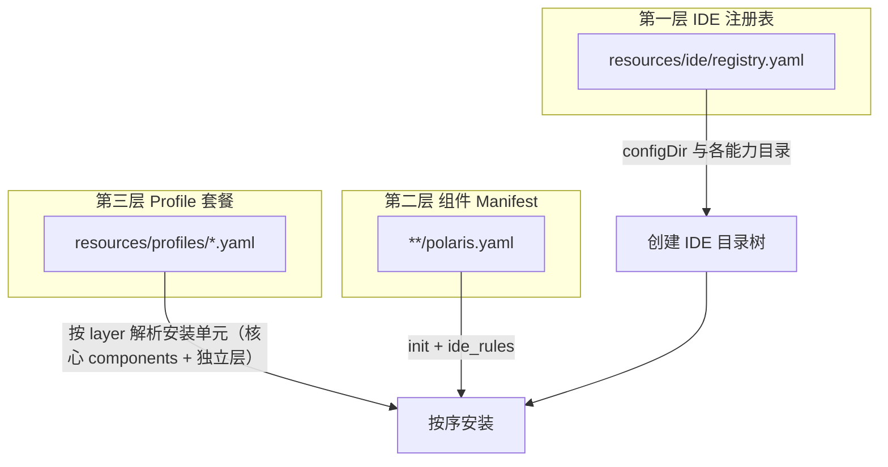

# Polaris Resources 配置指南

本文档描述 `resources/` 目录下配置文件的**目标格式与语义**，供维护 `resources/` 与后续重构 polaris-cli 实现时对照使用。

> **范围**：配置作者与 CLI 重构者。不描述当前旧版 CLI 的兼容行为；若实现与本文不一致，以实现本文为准进行重构。  
> **相关**：安装流水线见 [specs/08-install-flow.md](../specs/08-install-flow.md)；组件/Profile 历史规范见 [specs/02-component-schema.md](../specs/02-component-schema.md)、[specs/03-profile-schema.md](../specs/03-profile-schema.md)（重构后应与本指南对齐）。

---

## 1. 配置体系概览

Polaris 将 AI 开发环境配置分为三层，由 `polaris init` 一次性或分步落盘：



| 层级 | 文件 | 职责 |
|------|------|------|
| IDE 注册表 | `resources/ide/registry.yaml` | 声明支持的 IDE、项目内 `configDir`、各能力是否支持及默认落盘路径 |
| 组件 Manifest | `resources/**/<组件名>/polaris.yaml` | 单组件来源、安装文件清单、变体、按 IDE 差异化安装规则 |
| Profile | `resources/profiles/<name>.yaml` | 面向用户的「套餐」：按安装层**自包含**列出全部安装单元（不支持 Fragment / `extends`） |

**安装层顺序**由 `resources/init-layers.yaml` 定义，与组件 `category` 一一对应：

```yaml
order:
  - ide          # 仅创建目录；无独立组件 category
  - framework
  - skills
  - sub-agents
  - rules
  - commands
  - hooks
  - mcp
  - scaffold
  - context
```

`polaris init` 推荐流程：

1. 解析 Profile（单文件、无继承），得到各 layer 下的安装单元列表。
2. 根据用户选择的 IDE 列表，读取 registry，创建各 IDE 的 `configDir` 及支持的能力子目录。
3. 将**第一个**选中 IDE 的 `configDir`（如 `.cursor`）注入模板上下文 `{{configDir}}`（多 IDE 同时安装时，共享路径的组件需显式按 IDE 拆分，见 §6）。
4. 按 `init-layers.yaml` 顺序，对每个组件执行安装（文件复制/合并、CLI、post-init 命令）。

---

## 2. 支持的 IDE

当前 registry 声明的 IDE：**trae**、**qoder**、**cursor**（`resources/ide/registry.yaml`，`version: "1"`）。

### 2.1 项目内配置根目录

| IDE id | 显示名 | configDir | 说明 |
|--------|--------|-----------|------|
| `trae` | Trae | `.trae` | 规则、技能、子代理等落在项目内 |
| `qoder` | Qoder | `.qoder` | 同上 |
| `cursor` | Cursor | `.cursor` | 同上 |

路径均相对于**用户项目根目录**（`{{project_root}}`）。

### 2.2 能力（Capability）矩阵

每个 IDE 条目下可为下列能力配置 `support`、`dir`、`file`、`force`、`condition` 等字段。

| 能力 key | Trae | Qoder | Cursor | 默认目录/文件（相对项目或模板） |
|----------|------|-------|--------|--------------------------------|
| `rules` | ✓ | ✓ | ✓ | `{{configDir}}/rules` |
| `skills` | ✓ | ✓ | ✓ | `{{configDir}}/skills`（目录） |
| `sub-agents` | ✓ | ✓ | ✓ | `{{configDir}}/sub-agents`（`*.md`） |
| `commands` | ✗ | ✗ | ✗ | — |
| `hooks` | ✗ | ✗ | ✗ | —（Git hooks 走组件 `hooks`，见 §6.4） |
| `mcp` | ✓ | ✓ | ✓ | 见 §2.3 |
| `context` | ✓ | ✓ | ✓ | 项目根 `AGENTS.md` |

说明：

- `support: false` 表示该 IDE **不提供**此能力槽位；对应组件可通过 `ide_rules.<ide>.support: false` 跳过安装。
- `force` + `condition` 供 Doctor / 向导判断「是否缺少必要文件」，条件表达式语法见 §7.4。

### 2.3 MCP 默认落盘位置

| IDE | registry 中 mcp | 展开后典型路径 |
|-----|-----------------|----------------|
| trae | `dir: "{{project_root}}"`, `file: mcp.json` | `<项目>/mcp.json` |
| qoder | `dir: "~/Library/Application Support/Qoder/ShardClientCache"` | 用户目录下 Qoder 全局配置 |
| cursor | `dir: "~/.cursor"` | `~/.cursor/mcp.json` |

组件可在 `ide_rules.<ide>.dest` 覆盖合并目标文件路径（见 §6.2）。

### 2.4 registry.yaml 格式

```yaml
version: "1"    # 必填，字面量 "1"

ides:
  - id: cursor              # 必填：小写 kebab，唯一
    label: "Cursor"         # 必填：展示名
    description: "..."      # 必填
    icon: "https://..."     # 可选
    configDir: ".cursor"    # 必填：项目内 IDE 配置根（无前导 ./）

    rules:
      support: true
      dir: "{{configDir}}/rules"
      force: false
      condition: "!file_exists('{{project_root}}/{{configDir}}/rules/*.md')"

    skills:
      support: true
      dir: "{{configDir}}/skills"
      force: false
      file_type: dir
      condition: "!dir_exists('{{project_root}}/{{configDir}}/skills')"

    sub-agents:
      support: true
      dir: "{{configDir}}/sub-agents"
      force: false
      file_type: md
      condition: "!file_exists('{{project_root}}/{{configDir}}/sub-agents/*.md')"

    commands:
      support: false

    hooks:
      support: false

    mcp:
      support: true
      dir: "~/.cursor"
      file: mcp.json
      force: true
      condition: "!file_exists('~/.cursor/mcp.json')"

    context:
      support: true
      dir: "{{project_root}}"
      file: AGENTS.md
      force: true
      condition: "!file_exists('{{project_root}}/AGENTS.md')"
```

**Capability 字段说明：**

| 字段 | 类型 | 说明 |
|------|------|------|
| `support` | boolean | 是否支持该能力 |
| `dir` | string | 能力目录；可含 `{{configDir}}`、`{{project_root}}`、`~` |
| `file` | string | 单文件能力时的文件名（与 `dir` 组合） |
| `file_type` | string | 条件表达式中的占位（如 `md`、`dir`） |
| `force` | boolean | 是否强制要求存在 |
| `condition` | string | 条件表达式；为真时表示「仍缺失，需要安装」 |

新增 IDE：在 `ides` 追加条目，并实现安装引擎中的 IDE 适配器（合并策略、路径展开规则一致即可）。

---

## 3. 核心组件 Manifest（polaris.yaml）

每个可安装单元对应目录 `<搜索根>/<组件名>/polaris.yaml`。组件名 = 目录名（小写 kebab）。

> 说明：本文档将 `scaffold` 与 `context` 作为“独立处理层（工程结构/上下文）”单独说明，因此在“核心组件”章节中不把它们当作 components 来讲述；但实现层面仍会通过 `category`/`init-layers.yaml` 的顺序驱动安装。

### 3.1 搜索路径（bundled）

实现应在 `resources/` 下按序扫描（先命中者优先，禁止重名）：

| 搜索根（相对 `resources/`） | 用途 |
|----------------------------|------|
| `frameworks/` | 流程框架（openspec、superpowers） |
| `ide/common/` | 跨 IDE 共享（rules、skills、mcp 等） |
| `ide/trae/`、`ide/qoder/`、`ide/cursor/` | IDE 专属组件（可选） |
| `skills/` | 自研 Skill 包 |
| `scaffold/` | 项目脚手架（独立处理层：不属于核心 components 清单） |
| `others/` | CI 等其它工程配置 |
| `context/` | 项目上下文（AGENTS.md、SOUL 等）（独立处理层：不属于核心 components 清单） |

### 3.2 顶层字段

```yaml
name: openspec                    # 必填，与目录名一致，全局唯一
version: "1.2.0"                  # 必填，semver
description: "..."                # 推荐
category: framework               # 必填，见 §3.3
author: polaris-team              # 可选
homepage: https://...             # 可选 URL
internal: true                    # 可选；true 时不单独出现在组件市场列表

source:                           # 必填
  type: local | npm | github | url
  path: .                         # type=local：相对本 manifest 所在目录

cli: []                           # 可选：附带的 CLI 工具声明
init: {}                          # 可选：文件与安装后命令
variants: {}                      # 可选：变体过滤
ide_rules: {}                     # 可选：按 IDE 差异化安装，§6
check: []                         # 可选：doctor 检查项
requires: []                      # 可选：依赖其它组件名
conflicts: []                     # 可选：互斥组件名
```

### 3.3 category（安装层）

`category` 必须等于 `init-layers.yaml` 中的某一层（`ide` 层无对应组件，仅 registry 驱动目录创建）。

> 说明：`scaffold` 与 `context` 虽然也属于 `category` 枚举，但它们不在“核心 components”语义里；本文在后续会以独立处理层解释其用途与配置方式。

| category | 说明 | 示例组件 |
|----------|------|----------|
| `framework` | 工作流框架 | openspec, superpowers |
| `skills` | Agent 技能（zip/目录） | skills（common） |
| `sub-agents` | 子智能体定义 | sub-agents |
| `rules` | IDE 规则文件 | rules |
| `commands` | IDE 斜杠命令等 | （预留） |
| `hooks` | Git hooks 等 | hooks |
| `mcp` | MCP server 配置 | mcp |

### 3.4 source

```yaml
source:
  type: local
  path: .                         # 资源根 = manifest 所在目录

# 其它类型（远程组件）
source:
  type: npm
  package: "@scope/pkg"
  version: "latest"
```

### 3.5 cli（可选）

```yaml
cli:
  - name: openspec
    description: OpenSpec CLI
    install:
      type: npm
      package: "@fission-ai/openspec"
      version: "latest"
    uninstall:
      type: npm
      package: "@fission-ai/openspec"
    check: cli_installed("openspec")
```

`install.type`：`npm` | `binary` | `script`。

### 3.6 init

```yaml
init:
  scope: project                  # project | global

  commands:                       # 可选：安装后执行的命令
    - run: "openspec init"
      cwd: "{{project_root}}"
      condition: "!dir_exists('openspec/')"

  files:                          # 文件安装主配置（见 §3.7）
    config: { ... }
    files: [ ... ]
```

**禁止**把 `config` / `files` 直接挂在 `init` 下与 `files` 键并列（错误示例：`init.config` + `init.files` 数组）；统一使用 `init.files` 的**映射格式**或**数组格式**。

### 3.7 init.files — 文件清单

#### 3.7.1 映射格式（推荐）

```yaml
init:
  files:
    config:
      dest: "{{project_root}}/{{configDir}}/skills/"   # 组内默认目标目录/文件前缀
      method: copy                                      # copy | unzip；可写 [copy, unzip]
      overwrite: true                                   # 组内默认是否允许覆盖
    files:
      - name: brainstorming                             # 逻辑名，供 variants / ide_rules 引用
        src: superpowers/brainstorming.zip              # 相对 source.path
        dest: ""                                        # 可省略，继承 config.dest + 源文件名
        method: unzip                                   # 可省略，继承 config.method
        overwrite: false                                # 可省略，继承 config.overwrite
```

#### 3.7.2 数组格式（兼容）

```yaml
init:
  files:
    - src: templates/docs/
      dest: "{{project_root}}/docs/"
      overwrite: false
      method: copy
```

#### 3.7.3 字段说明

| 字段 | 必填 | 说明 |
|------|------|------|
| `name` | 映射格式推荐 | 稳定标识，供 `variants.*.files_include` 与 `ide_rules.*.files_include` 引用 |
| `src` | 是 | 源路径（文件或目录） |
| `dest` | 是* | 目标路径；*映射格式下可省略，由 `config.dest` + 源 basename 推导 |
| `method` | 否 | `copy`（默认）或 `unzip` |
| `overwrite` | 否 | 默认 `false`；`polaris init --force` 时视为 `true` |

目录源：递归复制目录内容到 `dest`（若 `dest` 以 `/` 结尾表示目录）。

### 3.8 variants（组件变体）

```yaml
variants:
  backend:
    name: 后端开发              # 可选：向导展示名
    description: 后端工作流
    files_include:              # 只安装列出的 init.files[].name
      - polaris-flow-backend
      - bugfix
      - backend_config
    default: true               # 至多一个 variant 可为 default

  frontend:
    files_include: [polaris-flow-frontend, bugfix, frontend_config]

  fullstack:
    files_include: [polaris-flow-fullstack, bugfix, fullstack_config]
```

| 字段 | 说明 |
|------|------|
| `files_include` | 白名单；未列出则不安装 |
| `files_exclude` | 黑名单（与 include 同时存在时，以实现定义为准，建议仅用其一） |
| `skills_include` | 仅作用于 `init.skills` 条目（若单独声明 skills 块） |
| `default` | 未指定 variant 时的默认选项 |

Profile 通过 `variant: backend` 选择组件变体。

### 3.9 check（Doctor，可选）

```yaml
check:
  - id: openspec-dir
    description: openspec/ 目录存在
    category: frameworks
    severity: error | warning | info
    check: dir_exists("openspec/")
    fix: run("openspec init")
    auto_fix: true
```

---

## 4. Profile 套餐

面向用户的入口：`polaris init <profile>`。Profile 按**安装层**组织安装单元，与 `resources/profiles/backend.yaml` 目标结构一致。

**设计约束（刻意简化）：**

- **不支持** `extends`、**不支持** `resources/profiles/fragments/`。
- 每个 Profile 必须**自包含**：该套餐需要的 `framework`、`skills`、`rules`、`mcp`、独立层 `scaffold`/`context` 等均在同一 YAML 内写全。
- 复用靠「多个 Profile 各自写全清单」或维护时脚本生成；不在运行时做 Profile 继承 merge。

### 4.1 顶层结构（目标格式）

```yaml
name: backend
version: "1.0.0"
description: 后端开发（Spring Boot 微服务）…
author: polaris-team

# 各 key 与 init-layers.yaml 的 layer 对应（不含 ide）：
# - `framework/skills/sub-agents/rules/commands/hooks/mcp`：作为“核心 components”被 Profile 管理
# - `scaffold/context`：作为“独立处理层（工程结构/上下文）”，不在 components 语义里，但仍走同一套 layer 顺序
framework:
  - name: openspec
    variant: full                 # 单个变体

  - name: superpowers
    variant: full

skills:
  - name: backend                 # 组件名 = 目录名
    variants:                     # 可多选（向导多选或逗号分隔）
      - java
      - python
      - c++

rules:
  - name: backend
    variants: [java, python, c++]

mcp:
  - name: backend
    variants: [java, python, c++]

hooks:
  - name: backend
    variant: full

sub-agents:
  - name: backend
    variant: full

commands: []                        # 可选层，无组件时可省略或空

scaffold:
  - name: backend
    variant: full

context:
  - name: backend
    variant: full                   # 对应 context 组件的 variant key

settings:
  overwrite_existing: false
  backup: true
  interactive: true
  scope: project
```

### 4.2 组件引用字段

| 字段 | 说明 |
|------|------|
| `name` | 在核心 components layer 下表示组件名（解析为 `<name>/polaris.yaml`）；在 `scaffold/context` layer 下表示对应工程结构/上下文包名（同样通过 `<name>/polaris.yaml` 入口落盘） |
| `variant` | 单个变体（与 `variants` 二选一） |
| `variants` | 多个变体；安装时合并各变体的 `files_include` 或按向导选择其一（实现需定义：推荐向导单选 variant，高级模式多选） |
| `options` | 透传给组件（如 superpowers 的 skill 子集） |

### 4.3 展开为安装列表

实现应将 Profile **规范化**为有序列表：

```text
{ layer, name, variant?, variants?, options? }
```

排序键：`init-layers.yaml` 中 `order` 的下标；同层内保持 YAML 声明顺序。

示例：`backend` Profile 在仅选 `openspec@full`、`rules@java`、`context@backend` 时，安装序列为：

1. `framework/openspec` → variant 由 openspec 的 `full` 映射到 `files_include`（若 openspec 使用 `full` 别名，需在组件 variants 中定义 `full` → 实际 include 列表）
2. `framework/superpowers`
3. … 其余 layer

> **openspec 变体命名**：当前 manifest 使用 `backend` / `frontend` / `fullstack`；Profile 中 `variant: full` 表示「完整/默认套餐」时，应在 openspec 增加 `full` variant 或在 Profile 解析层将 `full` 映射为 `backend` 等。重构时统一命名，避免 `full` 与 `fullstack` 混淆。

### 4.4 精简套餐示例（frontend）

与 `backend` 结构相同，仅变体与层内容不同；**不得**使用 `extends`：

```yaml
name: frontend
version: "1.0.0"
description: 前端开发…

framework:
  - name: openspec
    variant: frontend
  - name: superpowers
    variant: default

rules:
  - name: rules          # 共用 ide/common 包时 name 即目录名
    variant: default

# skills / mcp / sub-agents / hooks / scaffold / context …
# 各层按需写全，省略的 layer 表示该套餐不安装该层

context:
  - name: context
    variant: frontend

settings:
  overwrite_existing: false
  backup: true
  interactive: true
  scope: project
```

`fullstack` 同理：所有 layer 在一文件内声明，`openspec`/`context` 等使用 `fullstack` 或 `full` 变体（命名需在重构时统一，见 §4.3 说明）。

### 4.5 目标 Profile 一览

| Profile | 定位 | 说明 |
|---------|------|------|
| `backend` | 后端为主 | 自包含；多技术栈 `variants`（java/python/c++） |
| `frontend` | 前端为主 | 自包含；`context@frontend` 等 |
| `fullstack` | 全栈 | 自包含；各层 fullstack 变体 |

### 4.6 settings

| 字段 | 默认 | 说明 |
|------|------|------|
| `overwrite_existing` | `false` | 是否覆盖已存在文件 |
| `backup` | `true` | 覆盖前备份到 `.polaris-backup/<timestamp>/` |
| `interactive` | `true` | `false` 等同 `--yes` |
| `scope` | `project` | `project` \| `global`，可被 CLI `--scope` 覆盖 |

### 4.7 ides（可选）

```yaml
ides: [trae, qoder, cursor]         # 默认目标 IDE；可被 --ide 覆盖
```

未写时由 init 向导多选；实现应校验 id 存在于 registry。

---

## 5. IDE 公共组件索引（ide-common）

`resources/ide/common/polaris.yaml` 为**逻辑索引**（非独立安装组件），列出默认随 IDE 套餐初始化的一组 common 包。

> 注意：字段名虽为 `components`，但其中 `scaffold` 与 `context` 属于“独立处理层（工程结构/上下文）”，不与核心 components 混用语义。

```yaml
name: ide-common
version: "1.0.0"
internal: true
category: rules                    # 仅用于分类占位

components:
  - name: rules
  - name: skills
  - name: sub-agents
  - name: mcp
  - name: hooks
  - name: context
  - name: scaffold
```

重构时：解析器可在「未写某 layer」时按产品策略默认注入 ide-common 列表；**不得**通过 Fragment/`extends` 间接引用。

---

## 6. 按 IDE 差异化安装（ide_rules）

同一组件在不同 IDE 下路径、格式、是否安装可能不同。通过 Manifest 的 `ide_rules` 声明。

### 6.1 设计原则

- **`init.files`**：定义组件拥有的全部文件及默认逻辑名（`name`）。
- **`ide_rules.<ideId>`**：定义该 IDE 安装哪些文件、写到哪、如何合并。
- **`registry`**：提供各 IDE 的默认目录前缀（如 `rules.dir`）。

对某个 IDE 未配置 `ide_rules` 条目时：**不**向该 IDE 安装此组件（或仅执行与 IDE 无关的 `init.files` 中 `dest` 已含绝对项目路径的条目——实现应二选一并文档化；**推荐**：凡依赖 `{{configDir}}` 的条目必须通过 `ide_rules` 或统一 `dest` 展开）。

### 6.2 ide_rules 条目格式

```yaml
ide_rules:
  <ideId>:                          # trae | qoder | cursor | …
    support: false                  # 可选；false = 该 IDE 跳过本组件
    dest: "{{project_root}}/mcp.json"   # 可选；本 IDE 合并/写入的主目标（MCP、单文件规则）
    merge: append                   # 可选：overwrite | append | skip（默认 append）
    files_include:                  # 可选：白名单，引用 init.files[].name
      - context7
      - time
    files_include:                  # 或带 per-file 覆盖：
      - name: thinking-base
        dest: thinking_base.mdc     # 覆盖文件名/扩展名
        merge: overwrite
```

| 字段 | 说明 |
|------|------|
| `support` | `false` 时整个组件对该 IDE 不安装 |
| `dest` | 单文件目标的完整路径（MCP json、合并目标等） |
| `merge` | `overwrite`：覆盖；`append`：带 sentinel 块追加；`skip`：已存在则跳过 |
| `files_include` | 字符串 = `name`；对象可含 `name`、`dest`、`merge` |
| `files_exclude` | 可选黑名单 |

**路径解析顺序**（实现要求）：

1. `files_include[].dest`（条目级）
2. `ide_rules.<ide>.dest`（IDE 级，用于 MCP 等）
3. `registry` 中该 IDE 对应能力的 `dir` + 源文件名（rules/skills/sub-agents）
4. 若 `dest` 为裸文件名（无 `/`），前缀为 `registry.rules.dir` 等

模板变量在写入前展开：`{{project_root}}`、`{{home}}`、`{{configDir}}`、`{{global_dir}}`。

### 6.3 能力 → 默认落盘（由 registry + ide_rules 共同决定）

| category | 典型 registry 前缀 | ide_rules 作用 |
|----------|-------------------|----------------|
| `rules` | `{{configDir}}/rules/` | 选文件；Cursor 可将 `.md` 映射为 `.mdc` |
| `skills` | `{{configDir}}/skills/` | 选 zip；`init.files.config.dest` 常含 `{{configDir}}` |
| `sub-agents` | `{{configDir}}/sub-agents/` | 选 md 文件列表 |
| `mcp` | IDE 各异 | **必须**用 `ide_rules.<ide>.dest` 指向最终 `mcp.json` |
| `hooks` | 无（registry hooks.support=false） | `dest` 指向 `.git/hooks/pre-commit` 等 |
| `context` | 项目根 | `AGENTS.md` 等已在 `init.files.dest` 写绝对路径 |

### 6.4 配置示例

#### rules（Trae/Qoder 用 .md，Cursor 用 .mdc）

```yaml
init:
  files:
    config:
      method: copy
      overwrite: true
    files:
      - name: thinking-base
        src: thinking-base.md
        dest: thinking-base.md
      - name: generate-gitcommitmessage
        src: generate-gitcommitmessage.md
        dest: generate-gitcommitmessage.md

ide_rules:
  trae:
    files_include: [thinking-base, generate-gitcommitmessage]
  qoder:
    files_include: [thinking-base, generate-gitcommitmessage]
  cursor:
    files_include:
      - name: thinking-base
        dest: thinking_base.mdc
      - name: generate-gitcommitmessage
        dest: generate-gitcommitmessage.mdc
```

#### mcp（三 IDE 不同路径）

```yaml
init:
  files:
    config:
      method: append
      overwrite: true
    files:
      - name: context7
        src: context7.json
      - name: time
        src: time.json

ide_rules:
  trae:
    dest: "{{project_root}}/mcp.json"
    files_include: [context7, time]
  qoder:
    dest: "{{home}}/Library/Application Support/Qoder/ShardClientCache/mcp.json"
    files_include: [context7, time]
  cursor:
    dest: "{{home}}/.cursor/mcp.json"
    files_include: [context7, time]
```

#### hooks（Trae 不支持）

```yaml
ide_rules:
  trae:
    support: false
  qoder:
    files_include: [pre-commit]
  cursor:
    files_include: [pre-commit]
```

#### skills（共用 configDir）

```yaml
init:
  files:
    config:
      dest: "{{project_root}}/{{configDir}}/skills/"
      method: [copy, unzip]
      overwrite: true
    files:
      - name: brainstorming
        src: superpowers/brainstorming.zip
```

### 6.5 合并策略（append）

`merge: append` 时，实现应使用 sentinel 块（如 `<!-- polaris:begin:<id> -->` … `<!-- polaris:end:<id> -->`），以便重复安装时替换同一块而非重复追加。详见 specs/08-install-flow。

---

## 7. 模板变量与条件表达式

### 7.1 模板变量

| 变量 | 含义 |
|------|------|
| `{{project_root}}` | 用户项目绝对路径 |
| `{{home}}` | 用户主目录 |
| `{{configDir}}` | 当前选中 IDE 的 config 目录名（如 `.cursor`，无点路径前缀由实现与 registry 约定） |
| `{{global_dir}}` | 通常 `~/.polaris` |
| `{{ide}}` | 当前 IDE id |

未定义变量应报错，避免静默写入错误路径。

### 7.2 多 IDE 同时安装

- `initIde` 为**每个**选中的 IDE 创建目录树。
- `{{configDir}}` 在单次 `runAdd` 中通常只有一个值（建议：按 IDE 循环调用安装，每次传入对应 `configDir`；或组件仅用 `ide_rules` 指定路径，不依赖共享 `{{configDir}}`）。

### 7.3 条件表达式（condition / check）

用于 `init.commands[].condition` 与 registry `condition`：

| 函数 | 说明 |
|------|------|
| `dir_exists(path)` | 目录存在 |
| `file_exists(path)` | 文件存在（支持 `*` 通配） |
| `cli_installed(name)` | CLI 在 PATH |
| `npm_global_installed(pkg)` | 全局 npm 包 |

前缀 `!` 表示取反。路径可使用 `{{project_root}}` 等模板。

---

## 8. 目录与命名约定

### 8.1 推荐 resources 布局

```text
resources/
├── init-layers.yaml
├── init-wizard.yaml
├── ide/
│   ├── registry.yaml
│   ├── common/
│   │   ├── polaris.yaml          # ide-common 索引
│   │   ├── rules/
│   │   ├── skills/
│   │   ├── sub-agents/
│   │   ├── mcp/
│   │   └── hooks/
│   ├── trae/                     # 可选：IDE 专属
│   ├── qoder/
│   └── cursor/
├── frameworks/
│   ├── openspec/
│   └── superpowers/
├── context/
├── scaffold/
└── profiles/
    ├── backend.yaml
    ├── frontend.yaml
    ├── fullstack.yaml
```

### 8.2 命名

- 组件名、Profile 名、variant 名：`lowercase-kebab`。
- `init.files[].name`：kebab，与 `files_include` 引用一致。
- 源文件扩展名按 IDE 要求（Cursor rules 常用 `.mdc`）。

---

## 9. 维护检查清单（重构后）

1. `registry.yaml` 通过 schema 校验，IDE id 无重复。
2. 每个 `polaris.yaml` 通过组件 schema；`variants.*.files_include` 均引用存在的 `init.files[].name`。
3. 每个 Profile 层引用的组件在搜索路径中存在。
4. `ide_rules` 中每个 `files_include` 的 name 存在于对应组件 `init.files`。
5. `polaris init <profile> --dry-run --offline` 输出计划与预期路径一致。
6. 对 trae / qoder / cursor 分别 dry-run，确认 MCP、rules 路径正确。

---

## 10. 与旧版实现的差异（重构对照）

|  topic | 旧版/现状 | 本指南目标 |
|--------|-----------|------------|
| Profile 结构 | 扁平 `components: []` + `extends` + fragments | 按 layer 自包含；**无** `extends` / fragments |
| ide_rules | 仅 `src`+`dest`+`merge` | 增加 `files_include`、`support`、IDE 级 `dest` |
| init.files | 部分 manifest 将 `config` 误挂在 `init` 下 | 统一为 `init.files` 映射格式 |
| category | 文档中 `workflow-framework` 等旧枚举 | `framework`、`skills`、`rules` 等与 init-layers 一致 |
| openspec variant | Profile 写 `full` | 与 manifest `backend/frontend/fullstack` 对齐 |
| 组件索引 | ide-common 含 `components` 列表 | 解析器可选默认 common 集；Profile 仍须自包含或显式省略 layer |

重构完成后，应更新 [specs/02-component-schema.md](../specs/02-component-schema.md)、[specs/03-profile-schema.md](../specs/03-profile-schema.md) 与本指南保持一致，并在 [development.md](./development.md) 中链接本指南。

---

## 附录 A：核心组件清单（当前 resources 目标）

| 组件 | 路径 | category |
|------|------|----------|
| openspec | `frameworks/openspec/` | framework |
| superpowers | `frameworks/superpowers/` | framework |
| rules | `ide/common/rules/` | rules |
| skills | `ide/common/skills/` | skills |
| sub-agents | `ide/common/sub-agents/` | sub-agents |
| mcp | `ide/common/mcp/` | mcp |
| hooks | `ide/common/hooks/` | hooks |

技术栈细分组件（`backend@java`、`rules@vue3` 等）需在 `resources/` 下按相同 Manifest 规则新增目录，并在 Profile 的对应核心 components layer 中引用。

## 附录 C：独立处理层资源（scaffold/context）

| 资源 | 路径 | layer/category |
|------|------|---------------|
| scaffold | `scaffold/` | scaffold |
| context | `context/` | context |

它们会被 `init-layers.yaml` 的 layer 顺序驱动安装，但在本文档中不纳入“components 语义”的核心清单。

## 附录 B：init 向导（init-wizard.yaml）

向导步骤与 Profile 解析独立配置，见 `resources/init-wizard.yaml`：`profile` → `ide` → `components`（变体/Skills）→ `scope` → `confirm`。重构时 `components` 步骤应能展示 layer 分组后的组件与 variant 选择。
