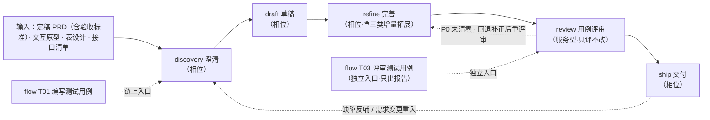

# 测试用例工作流设计（testing 族）

> 状态：设计稿（待评审）
> 日期：2026-09-30
> 关联：`src/core/config/task-kind-layout.ts`（`testcase` kind）、`src/core/hooks/state-next.ts`、`assets/shared/templates/testcase-state.example.yaml`
> 来源思路：《渐进式有效测试用例编写思路》（用户整理，五阶段：用例设计 → 分层 → 非功能 → 接口与自动化 → 闭环迭代）
> 同族既有文件：`assets/zh/skills/testing/case/SKILL.md`、`assets/zh/skills/testing/acceptance/SKILL.md` —— **内容为早期 AI 产物，不作为判据源**（见 §二）

---

## 一、结论

**本设计不新造工作流形态，而是把平台里已经存在的 `testcase` kind 填实。** 与之对齐的范本是 **`requirement`（prd）族**。

平台侧骨架基本就位：kind 已登记、`storageSegment=testcases`、state 模板已入仓、`draft-create` / `task-state-entry` / `workflow-entry` / `state-next` / dashboard 扫描全部已支持 `testcase`。唯一缺口是：

- **各阶段没有技能**——`task-kind-layout.ts` 中 testcase 四个阶段的 `skill` 字段全部为 `null`，`state-next` 因此给不出下一阶段技能名，游标推到阶段就断。

设计工作 = ① 补齐 `assets/zh/skills/testing/{discovery,draft,refine,ship}/` 四个阶段技能；② 新增一个**服务型** `testing/review`（不进相位表）；③ 把 `draft`/`refine`/`ship` 的 `skill: null` 去掉，让 `skillForPhase` 的**同名默认映射**生效（`discovery` 保留 `skill: null`，与 `requirement`、`coding`、`prototype`、`debug` 四族的入口阶段完全一致）。

### 1.1 `review` 的落位：照搬 `prd/review` 模式（本设计的核心判断）

用户要求：*「Review 是 ship 前特别重要的一个环节，同时 Review 也可以单独调用，评审既有的测试用例。」*

这两条要求**合起来指向的形态，在仓库里已有现成范本**——`requirement` 族的 `prd/review`：

| 特征 | `prd/review` 的实际做法 | 证据 |
|---|---|---|
| 不是相位 | `requirement.phases` 只有 `discovery / draft / refine / ship` 四段，**没有 `review`** | `task-kind-layout.ts:170-175` |
| 是服务型技能 | 由 `prd/refine` 的 **Step 4** 内部派发；游标从不落在它上面 | `prd/refine/SKILL.md` Step 4 |
| 派发方式 = 独立 subagent | `subagent-probe`（`task_type=doc_review`）→ `subagent-dispatch`；把 **`prd/review` 的 `SKILL.md` 路径当 `materials`** 交给 subagent 加载评审方法 | `prd/refine/SKILL.md` §4.0 / §4.1 / §4.2 |
| 工作流**必走** | `prd/refine` Step 4.3：P0/T0 **清零后才**进入 Step 5 定稿、Step 6 置 `phase=ship` | `prd/refine/SKILL.md` Step 4.3 / Step 6 |
| 可**独立**调用 | 技能 `description` 自述触发场景「(1) 用户要求评审 PRD」；同族的 `prd/readiness` 更有独立命令入口「本命令是 `prd/ship` Step 1 的独立触发入口，行为与 ship 内调用完全一致」 | `prd/review/SKILL.md` frontmatter；`commands/prd/readiness.md` |

**同一个形态在 `coding/verify` Step 14 也有**（更直白地写出了它的性质）：

> *Step 14（独立代码评审）与 Step 15（人工验证）是内嵌的**子步，不是阶段** —— 不占游标、不写 `phase`。* —— `verify/SKILL.md:50`

**因此 `testing/review` 采用同一形态**：独立技能 → 由 `testing/refine` 以 **subagent** 派发 → 工作流必走 → 且可独立调用。**不新增相位，不改 `src/` 的相位表。**

> **为什么「必走的环节」不需要是相位**：相位只解决「游标停在哪」与「自动衔接下一个技能」；而「必走」由**阶段技能内部的 Step 顺序 + 出口门禁**保证——`refine` 的评测步骤**未清零 P0 就不允许推进 `phase=ship`**。这与 `prd/refine`（P0/T0 清零才置 ship）和 `verify`（Step 14 Critical 未清则阻断收口）是同一套机制。两者组合即可同时满足「链上环节 + 独立可调」，**无需把服务型技能提为相位**。

### 1.2 为什么不把 `review` 做成相位

| 方案 | 说明 | 判定 |
|---|---|---|
| **服务型技能（本设计，对齐 `prd/review`）** | 由 `refine` 内部以独立 subagent 派发；工作流必走；用户可独立触发。相位表**零改动** | ✔ |
| 注册为相位但不接游标（`prototype/review` 模式） | 需在 phases 数组插 `review` 键；且 `prototype` 的注释已明确该键「**已知不被游标写入**，仅保留同名映射」，并自陈改它会牵动 Dashboard 契约与两处断言 | ✖ 只借了相位的名，换不来任何能力，却引入契约涟漪 |
| 真推进相位 `refine → review → ship` | 相位表 + Dashboard 契约 §6.2 + `task-kind-phases.test.ts` + `state-next.test.ts` 四处连带改动；收益仅是面板多一格步骤条 | ✖ 成本远大于收益，且与 `requirement` 族**形态不一致** |

决定性理由：`requirement` 与 `testcase` 是**同一类工作**（澄清 → 草稿 → 完善 → 交付，均无「实现」段），两族在平台上应对齐。既然 `requirement` 用服务型 `review` 成立且运转正常，`testcase` 不应另造结构。

---

## 二、权威边界（先说清哪些能当判据）

**判据唯一源原则**：只有「受版本控制、可 diff、可评审」且在仓库流程中真实被消费的文件才能作为判据出处。仅凭 `git ls-files` 存在不足以判定——需看内容来源。

| 文件 / 位置 | 是否可作为判据 | 判定依据 |
|---|---|---|
| `src/core/config/task-kind-layout.ts` 的 `testcase` 段 | ✅ **是** | 代码，可 diff；注释自述「权威口径 = 本表」 |
| `src/core/config/task-kind-layout.ts` 的 `requirement` 段 | ✅ **是** | 本设计的**形态范本**（四相位 + 服务型 review） |
| `assets/shared/templates/testcase-state.example.yaml` | ✅ **是** | 入仓；与 kind 表互为守门件 |
| `src/core/assets/layout.ts` 的 `SKILL_FAMILIES` | ✅ **是** | 代码；`testing` 族已在册，且注释明确「测试族固定为 `testing`，**不可用 `test`**」 |
| `src/core/hooks/state-next.ts`（`testcase: 'testing'`） | ✅ **是** | 代码；声明 kind→族 映射 |
| `assets/zh/skills/coding/tasks/references/test-case-checklist.md` | ✅ **是**（今日新增、未提交） | 09-30 新写；自述「**场景分类的唯一语言**」，被 `test-review-methodology.md` 复用 |
| `assets/zh/skills/prd/review/SKILL.md` + `prd/refine/SKILL.md` Step 4 | ✅ **是** | 服务型评审技能的**形态范本**（派发链、只评不改、P0 清零门禁） |
| `assets/zh/skills/coding/verify/SKILL.md` Step 14 | ✅ **是** | 「内嵌子步 ≠ 阶段」的**明文出处**；执行口径唯一源（五槽 / 三级分叉 / 覆盖率 / 基线红名单） |
| `assets/zh/skills/maintance/codereview/references/security-checklist.md` | ✅ **是** | 安全清单唯一源 |
| `assets/zh/policies/*` | ✅ **是** | 顶层注入，跨技能共用规则的唯一合法位置 |
| `assets/zh/skills/testing/case/SKILL.md` | ❌ **否** | 内容为早期 AI 产物；虽已入库，但其「三类场景 / 7 类异常源 / 用例字段」等表述无上游依据 |
| `assets/zh/skills/testing/acceptance/SKILL.md` | ❌ **否** | 同上 |

> **处置结论**：两个既有文件**不是需要「上收」的资产**，而是需要被替换的空壳。新族的判据从「用户方法论 + 行业标准 + 上表真源」重新写，不继承其分类语言。

---

## 三、设计目标与非目标

**目标**

1. 四个**阶段技能**与 `testcase` kind 的四阶段一一对应，命名与 requirement 族保持一致（`discovery` / `draft` / `refine` / `ship`）。
2. 一个**服务型技能** `review`，形态与 `prd/review` 完全同构（由 refine 派发 + 必走 + 可独立调用）。
3. 把方法论的五阶段完整落位，且**每一阶段都有唯一判据源**，不新起第二套分类语言。
4. 与既有工作流的编写风格、命名、文档组织**逐项对齐**（HARD-STOP / 标识约定 / Step 0..N / 上下文压缩恢复 / 自动衔接）。

**非目标**

- **不新建 kind，不新增 stage，不改 Dashboard 契约**。`testcase` 相位序列维持 `discovery → draft → refine → ship` 四段不变。
- 不改 `coding` / `requirement` / `prototype` / `debug` 各族的相位序列。`review` 在三族（`prd` / `prototype` / 本族）都**不作为推进相位**。
- 不在本族内定义测试执行口径（执行委托 `coding/verify`）。
- 不定义安全清单（引用 `maintance/codereview`）。
- 本批只做中文（`assets/en/skills/` 目前为空，不阻塞）。

---

## 四、工作流形态

> **推进游标上只有 4 个相位**：`discovery → draft → refine → ship`。`review` 是**服务型技能**——它出现在流动链上，**不在** Dashboard 的 phase 序列里，由 `refine` 的出口步骤以 **subagent** 派发（主路径），或由用户**独立触发**（评审既有用例集）。形态与 `polaris{{SKN_SPR}}prd{{SKN_SPR}}review`、`polaris{{SKN_SPR}}coding{{SKN_SPR}}verify` Step 14 同类。

### 4.1 为何是「阶段技能族 + 一个服务型技能」

| 方案 | 优点 | 缺点 | 判定 |
|---|---|---|---|
| 单入口（仿 `normal` / `tweak`） | 一次会话跑完、无跨技能衔接成本 | 五阶段判据塞进一个 SKILL.md → 极长；无法只做某一阶段；上下文必然溢出 | ✖ |
| **阶段技能族（本设计）** | 与 platform 的 `testcase` kind 对齐；可按需进入；上下文分片；`state next` 可自动衔接 | 需配套入口命令与 `skill` 字段对齐（**不涉及相位表改动**） | ✔ |
| 阶段技能族 + `review` **相位** | 面板多一格步骤条 | 相位表 + 契约 + 两处断言连带改动；与 `requirement` 族形态不一致 | ✖ |

决定性理由：kind 与 state 已存在，单入口方案等于**绕过平台契约另造一套**，且会让 dashboard 的步骤条失去数据来源。而把 review 提为相位，则要为一格步骤条付契约代价——不值。

### 4.2 方法论五阶段 → 技能族的落位映射

| 方法论阶段 | 落点 | 压缩理由 |
|---|---|---|
| 阶段一 基础筑基（意图拆解 / 骨架 / 正向 / 反向 / 数据脚本） | `discovery` 承载「意图 + 条目 + 范围 + 策略」；`draft` 承载「用例正文」 | 阶段一的「先定测试意图清单再写用例」是两道不同的动作，天然分属澄清与草稿 |
| 阶段二 L1-L4 分级 | `draft` | 分级是对**同一批用例**的标注，与用例正文同批产出，拆开会造成两次落盘和版本错位 |
| 阶段三 非功能 + 阶段四 接口/自动化 | `refine` | 两者同属「功能用例之外的增量拓展」，合并为一个阶段、以子节承载 |
| 阶段一的「质量校验」（用例自评 → **人工交叉评审**） | 自评留在 `draft` 的覆盖校验；**交叉评审**独立为 `review` **服务型技能**（由 `refine` 派发） | 评审是「对已产出用例集的独立把关」，与生成动作**不同性质**；压在 `draft` 内会退化成自审、失去独立性。独立上下文正是本设计选择 subagent 派发的原因 |
| 阶段五 闭环迭代与准出支撑 | `ship` | 准出报告与资产入库是一次性交付动作 |
| 阶段五的「持续迭代」（需求变更同步 / 缺陷反哺 / 回归集动态调优） | `ship` 内的**运营约定**章 + 重入 `discovery` | 持续迭代是**长期运营**，不是一次性阶段；写规则、由后续流程重入执行 |

---

## 五、技能设计

### 5.1 `testing/discovery` — 澄清（相位）

| 项 | 内容 |
|---|---|
| 定位 | 把「要测什么」钉死：测试意图、需求条目清单、范围与粒度、分层与自动化策略 |
| 输入（必需） | 定稿 PRD（含验收标准，唯一真相）；缺验收标准先走 `polaris{{SKN_SPR}}testing{{SKN_SPR}}acceptance` |
| 输入（可选） | 交互原型、数据库表设计、接口清单（后两者见 §九 决策 3） |
| 步骤 | ① 输入加载 + 需求条目编号（沿用 PRD 原编号，缺失按 `F{章节}-{序号}` 补编） ② **测试意图清单**（模块 → 子功能 → 功能点三级拆解，作为后续总纲） ③ 范围与粒度确认 ④ 分层策略（本版做几层）与自动化策略（哪些批次转自动化） ⑤ 出口门禁 |
| 产物 | `.polaris/testcases/<task_id>/testcase_plan.md`（**即 kind 的 bootstrap 文件名**，与 state 的 `plan_path` 字段对应） |
| 判据 | §六 表的「场景枚举语言」与「分层与优先级」 |
| 停顿点 | 范围/粒度未定时暂停等用户选；验收标准缺失时一次问全 |
| 阶段 `skill` | `null`（入口阶段，由命令显式进入，与 `coding/specify`、`prd/discovery` 同理） |

### 5.2 `testing/draft` — 草稿（相位）

| 项 | 内容 |
|---|---|
| 定位 | 产出功能用例全集 + 分层标注 + 追溯矩阵 |
| 输入 | `discovery` 的 `testcase_plan.md` |
| 步骤 | ① 正向主干（**单条用例只验证一个行为点**，避免失败无法定位） ② 反向场景（按统一枚举语言逐类过一遍，无对应场景必须显式标「无」） ③ 边界取点 ④ 数据构造脚本设计（入口 / 参数 / 清理方式） ⑤ **分层标注**（L1-L4 或 P 级，见 §九 决策 1） ⑥ 覆盖校验 + 需求↔用例双向追溯矩阵 |
| 产物 | `.polaris/testcases/<task_id>/test-cases.md`（用例集 + 追溯矩阵 + 数据构造脚本清单） |
| 判据 | §六 表 |
| 停顿点 | 枚举不充分（某类无落点却未标「无」）→ 回补；覆盖不足 → 输出待补清单 |
| 出口 | 推进 `phase=refine` |

### 5.3 `testing/refine` — 完善（相位，含必走的评审派发）

| 项 | 内容 |
|---|---|
| 定位 | 在功能用例之外做三类增量拓展（非功能 / 接口 / 自动化），并在出口**派发独立评审** |
| 步骤 | **①（功能用例集加载）** 取 `draft` 的 `test-cases.md` 作为评审对象的一半 **② 非功能拓展**：性能（基准 / 并发 / 压力与稳定性，每条**必须带指标阈值**）+ 安全（基础 + 业务，清单**引用** `polaris{{SKN_SPR}}maintance{{SKN_SPR}}codereview` 的 `references/security-checklist.md`，不复制） **③ 接口拓展**：单接口（正向 / 参数异常 / 边界 / 权限）→ 业务场景串（按 L1-L2 链路串联）；对齐 `coding/verify` 的 `contract` 槽语义 **④ 自动化转化**：先核心后边缘、先正向后反向，分批次；保留业务语义、补齐元素定位 / 数据驱动 / 断言 **⑤ 输出完整用例集并落盘**（`test-cases.md` 的增量 + 本阶段三类产物合并为可评审的整体，作为下步评审的**唯一对象**） **⑥ 派发独立评审**（见下） |
| 产物 | `.polaris/testcases/<task_id>/` 下：非功能用例、接口用例、自动化脚本集与报告模板 |
| 停顿点 | 性能指标缺失 → 记入待确认清单，不编造阈值 |
| 出口 | **未派发或评审未清零 P0 时，禁止置 `phase=ship`**；P0 清零后置 `phase=ship` |

#### 5.3.1 评审派发（必走子步，形态对齐 `prd/refine` Step 4 与 `verify` Step 14）

> **本子步是「内嵌的独立评审」，不是阶段** —— 不占游标、不写 `phase`。

**入口条件**：功能用例集与 `refine` 三类增量**均已落盘**（不存在未归因的缺口）。存在未落盘的缺口时不得开始评审。

**① 能力探测**：读 SessionStart 注入的 `PLATFORM_DEGRADATION` / `SUPPORTS_SUBAGENT`。

- `PLATFORM_DEGRADATION=inline|unsupported` → 直接进入「降级决策」
- `SUPPORTS_SUBAGENT=true` 且 degradation 空、且本步需要 `task_type=doc_review` 预筛 → **必须** `use_skill("polaris{{SKN_SPR}}subagent-probe")`（传 `platform`），取 `matched_agents` / `agents`
- `agents=[]` 且平台支持默认 subagent → 记 `agent=null`，`dispatch_mode_hint: default_subagent`

**② 派发**：`use_skill("polaris{{SKN_SPR}}subagent-dispatch")`，传入：

| 参数 | 值 |
|---|---|
| `platform` | 宿主平台 id（与 probe 同源） |
| `agent` | probe 结果（`matched_agents[0]`，或 `null` = 宿主默认 subagent） |
| `task_spec.task_type` | `doc_review` |
| `task_spec.task_description` | 对测试用例集做独立评审。加载并遵循 `polaris{{SKN_SPR}}testing{{SKN_SPR}}review` 技能的评审方法与报告格式，产出含分级问题清单与可核对定位的完整评审报告 |
| `task_spec.materials` | ① 用例集全文（`test-cases.md` + `refine` 三类增量产物）；② `discovery` 的 `testcase_plan.md`（意图清单 / 需求条目编号，覆盖判据）；③ 定稿 PRD（可选，覆盖取证源）；④ **`polaris{{SKN_SPR}}testing{{SKN_SPR}}review` 技能 SKILL.md 路径（供 subagent 加载评审方法）** |
| `task_spec.constraints.output_path` | `.polaris/testcases/<task_id>/testcase-review-report.md` —— **subagent 必须把报告写入该文件，回报只给路径；禁止把报告正文贴回** |
| `task_spec.constraints` | 只评审、**禁止修改任何文件**；问题必须分级；P0（阻塞）必须明确标注；输出语言跟随主会话 |
| `task_spec.language` | 跟随主会话语言 |

**③ 消费**：按 `dispatch.status`（`dispatched` / `degraded_default` / `degraded_inline` / `unsupported`）与 `result.status` 分支处理；`degraded_inline` = 主代理在本会话执行 = **降级，必须标注**；`unsupported` / `FAILED` → 进入降级决策（`./policies/decision-point.md`，**不得默认自审**）。

**④ 判定**：

| 报告结论 | 动作 |
|---|---|
| 存在 **P0** | **阻断** → 按 `./policies/decision-point.md`：A 回 `refine`/`draft` 补正后**重评审**（只重评修复项及其关联内容）/ B 用户接受风险并记 override（须显式确认）/ C 放弃。**不得**自行接受 |
| 仅 **P1** | 建议修复；不修复需在报告记录风险与接受理由 |
| 仅 **P2 / P3** | 记入报告，不阻断 |
| 报告未落盘 / 子代理 `FAILED` | 走降级决策 |

**⑤ 出口**：P0 清零 → 置 `phase=ship`；否则回退（增量缺失回 `refine`，功能用例缺陷回 `draft`）补正，重评审后再度判定。

> **不通过时的回退语义**：本族是**服务型派发**，回退由 `refine` 的 Step 内部循环表达（不改 `phase`），不是相位回退——与 `prd/refine` Step 4.3「重新派发 4.1 / 4.2 评审同一文件，迭代直到阻塞问题清零」完全一致。

### 5.4 `testing/review` — 用例评审（服务型技能）

| 项 | 内容 |
|---|---|
| 定位 | 对**已产出的用例集**做独立评审：覆盖是否完整、追溯是否双向闭合、用例是否可执行且无歧义、分级是否正确、数据是否独立、是否具备自动化就绪条件。**只评不改** |
| 触发 ①（链上 · 主路径） | 由 `testing/refine` 的 §5.3.1 子步以 **subagent** 派发（`task_type=doc_review`）；**每一轮 refine 必经**，P0 清零才放行 `ship` |
| 触发 ②（独立） | 用户在 flow「测试」类选「评审测试用例」（T03）进入，或直接要求评审某份既有用例集——**可以是本任务，也可以是别处已存在的用例文档**。此入口**只出报告、不改游标、不阻断任何流程** |
| 输入 | 触发①：`test-cases.md` + `testcase_plan.md` + `refine` 三类增量。触发②：用户指定的既有用例集（+ 可选的需求文档作覆盖判据）。缺输入不得凭印象评审 |
| 步骤 | ① 输入加载 + 评审范围确认 ② 逐项核对（覆盖 / 追溯 / 可执行 / 无歧义 / 分级 / 数据独立 / 自动化就绪）③ 问题分级 ④ 出评审报告 + （触发①时）重评审机制说明 |
| 产物 | `.polaris/testcases/<task_id>/testcase-review-report.md`（分级问题清单 + 重评审记录）；独立调用且无 task 上下文时，落用户指定路径或与用例集同目录 |
| 判据 | 族内 `references/01-review-criteria.md`；场景枚举**反查** `polaris{{SKN_SPR}}coding{{SKN_SPR}}tasks` 的 `references/test-case-checklist.md`（不复制） |
| 关卡 | **P0 清零才放行 `ship`**（仅在触发①生效）；重评审只重评修复项及其关联内容 |
| HARD-STOP | 与 `polaris{{SKN_SPR}}prd{{SKN_SPR}}review` / `polaris{{SKN_SPR}}prototype{{SKN_SPR}}review` 同款：只评不改、必须分级、必须给可核对定位、不得臆测、不得跳过维度 |
| 技能分类 | **服务型技能**（不进相位表；由 `refine` 派发或用户独立触发，与 `prd/review`、`prd/readiness`、`prototype/review` 同类） |

> **两条入口共用同一份判据与同一份报告模板**——不因入口不同而分叉出第二套口径。差异仅在「触发① 的结论会门禁 `ship`」「触发② 只出报告」。

### 5.5 `testing/ship` — 交付（相位）

| 项 | 内容 |
|---|---|
| 定位 | 准出材料 + 资产入库 + 持续迭代约定 |
| 步骤 | ① **准出报告**（分层通过率、需求覆盖率、自动化覆盖率、遗留缺陷）② 入库清单（用例资产 + 脚本资产）③ 归档 ④ **缺陷反哺规则**：测试 Bug 与线上问题均须反向补充对应层级用例，单点问题转通用回归校验点 |
| 产物 | `.polaris/testcases/<task_id>/testcase-report.md` + 归档 |
| 出口 | 准出判定形态可对齐 `prd/readiness` 的 PASS / CONDITIONAL / FAIL（形态复用，不共用判据） |
| 技能分类 | 终端技能：只到「上下文压缩恢复」并声明链路终点 |

---

## 六、判据唯一源

| 判据 | 唯一源 | 消费方式 |
|---|---|---|
| **场景枚举语言** | `polaris{{SKN_SPR}}coding{{SKN_SPR}}tasks` 的 `references/test-case-checklist.md`（6 大类 + 反模式 + 单行为原则） | 按其 6 大类逐类过；**扩展见 §九 决策 2** |
| **分层与优先级** | 待定 —— 见 §九 决策 1 | - |
| **用例集评审方法**（覆盖 / 追溯 / 可执行 / 无歧义 / 分级 / 数据独立 / 自动化就绪） | `testing/review` 的 `references/01-review-criteria.md`（族内新增） | 触发①②共用；场景枚举再**反查**上表 6 大类 |
| **评审技能形态**（派发链 / 只评不改 / 门禁语义） | `polaris{{SKN_SPR}}prd{{SKN_SPR}}review` + `polaris{{SKN_SPR}}prd{{SKN_SPR}}refine` Step 4 | 本族照搬形态，**不复制其字段清单** |
| **派发机制**（probe / dispatch / 降级） | `polaris{{SKN_SPR}}subagent-probe` + `polaris{{SKN_SPR}}subagent-dispatch` | 各技能按技能名引用 |
| 执行口径（五槽 / 三级分叉 / 基线红名单 / 覆盖率） | `polaris{{SKN_SPR}}coding{{SKN_SPR}}verify` | 只给指针，本族不跑测试 |
| 安全清单 | `polaris{{SKN_SPR}}maintance{{SKN_SPR}}codereview` 的 `references/security-checklist.md` | 只给指针 |
| 跨技能共用规则（停顿协议 / 自动衔接 / 硬约束） | `assets/zh/policies/`（顶层注入） | 各技能一律 `./policies/<name>.md` |

**跨技能引用只能按技能名**（如「按 `polaris{{SKN_SPR}}coding{{SKN_SPR}}tasks` 的 `references/…`」），不得写跨技能相对路径——安装器会拒收，且该做法在 `verify` Step 14 已有先例。

---

## 七、命名与文档组织

| 项 | 约定 |
|---|---|
| 技能 name | `polaris{{SKN_SPR}}testing{{SKN_SPR}}<skill>`，后缀 = 目录名 |
| 目录 | `assets/zh/skills/testing/{discovery,draft,refine,review,ship}/{SKILL.md, policies/, references/, templates/}` |
| 技能分类 | **四个阶段技能**（`discovery` / `draft` / `refine` / `ship`，游标推进）＋ **一个服务型技能**（`review`，不进相位表；由 `refine` 派发或用户独立触发） |
| 族名 | 只能是 `testing`（**不可用 `test`**，与仓库根 `test/` 冲突） |
| 入口命令 | 新建 `assets/zh/commands/testing/`（T01 走 flow；T03 独立入口，可仿 `commands/prd/readiness.md` 建 `review.md`）；命令文件**无需登记 manifest**（按目录扫描） |
| frontmatter | `name` + 只写路由信息的 `description`（≤1024）+ `version` |
| 正文骨架 | `# 标题` → `<HARD-GATE>` → 启动输出 → `## 标识约定` → `## 流程`（Step 0..N）→ 阻塞点 → `## 退出条件` → `## 上下文压缩恢复` → `## 自动衔接下一阶段` |
| `review` 的特殊性 | 服务型技能：**无「自动衔接下一阶段」章**（它不推进游标）；但**必须有**「上下文压缩恢复」（独立调用时会话可能中断） |
| 终端技能 | `ship` 只到「上下文压缩恢复」并声明链路终点 |
| 运行态 | `.polaris/testcases/<task_id>/state.yaml`（**四阶段块** + `plan_path`，**零新增字段**——`review` 是服务型，不占 state 子块） |

---

## 八、行业最佳实践对齐（作为各步判据背书）

| 方法论要点 | 对应实践 |
|---|---|
| 需求拆解 + 双向追溯矩阵 | ISO/IEC/IEEE 29119-3 的 test case / procedure / traceability；RTM 需求-用例-缺陷矩阵 |
| 反向场景与边界取点 | 等价类划分、边界值分析（BVA）、判定表、状态迁移法 |
| L1-L4 分层与准入闸门 | 风险驱动测试（RBT）+ 冒烟准入门禁；可挂既有 `policies/risk-signals.md` 的两轴 |
| 接口串联与自动化转化排序 | 测试金字塔 / Testing Trophy；「先核心后边缘、先正向后反向」= smoke 优先 |
| 数据可构造 / 可清理 / 不依赖执行顺序 | Fixture 与 Test Data Builder 模式 |
| 评审「生成与裁决分离」 | 独立评审者（Independent Review / Peer Review）；本设计以 **subagent 独立上下文**实现 |
| 准出判定 | Exit Criteria（覆盖率 / 通过率 / 遗留缺陷阈值） |
| 缺陷反哺回归 | Defect-driven regression（每个缺陷生成回归用例） |

---

## 九、待裁决决策点

### 决策 1：L1-L4 与 P0/P1/P2 的关系（最尖锐）

| 选项 | 说明 |
|---|---|
| A1 | 二者等价，二选一 |
| **A2（推荐）** | 保留 P 级为**唯一优先级轴**（已被 `test-case-checklist.md` 使用、被 verify 消费），L1-L4 降为**执行批次 / 准入视图**，写死映射 `L1 ⊇ P0 主流程` |
| A3 | 反过来，以 L1-L4 为分层主语言 |

**推荐 A2 的理由**：P 级的独有价值是「单条用例重要性」，已被现有两处消费者锁定；L1-L4 的独有价值是 **L1 的准入闸门语义**（L1 100% 通过才放行）——P 级没有这层含义。二者是不同轴，强行二选一必丢功能。

### 决策 2：需求级场景枚举是否扩展 6 大类

`test-case-checklist.md` 的 6 大类面向**代码级单元测试**（其 GWT 直接映射 AAA 断言）。方法论要求的业务级场景中，**「权限异常」「弱网 / 中断」「业务规则违例」在 6 大类中无落点**。

| 选项 | 说明 |
|---|---|
| B1 | 扩写 6 大类 —— 会牵动 `coding/tasks`、`coding/verify` 与 `tasks-review-agent`，风险外溢 |
| **B2（推荐）** | 在 `testing` 族内新增「需求级场景扩展表」，**逐条映射到 6 大类**并显式标注 6 大类未覆盖项；与 `maintance/codereview` 的「§一 粗切 / §二 细切必须互为落点」同一处理法 |

### 决策 3：两个新输入源

方法论阶段一要求「数据库表设计」、阶段四要求「ApiFox 接口清单」——仓库现有 PRD / 原型链路**没有**这两类输入的约定位。

| 选项 | 说明 |
|---|---|
| **C1（推荐）** | 降为**可选输入**：有则用（提升数据落库断言与接口用例质量），无则记 `No-Input` 并在报告中声明，不阻断 |
| C2 | 新增输入约定，要求这些文档必须存在 |

### 决策 4：`testing/case` 与 `testing/acceptance` 的处置

- `case`：**删除**（其职责由 `draft` 承接，内容不继承）。
- `acceptance`：**建议保留** —— 它产出的是需求侧 GWT 验收标准，供 `discovery` 作输入，属链路**上游**而非同层。若确认其内容同样是 AI 产物，则需重写而非保留。

### 决策 5：`review` 的落位模式 —— **已定为「服务型技能 + subagent 派发」（对齐 `prd/review`）**

用户要求：*「Review 是 ship 前特别重要的一个环节，同时 Review 也可以单独调用，评审既有的测试用例」*，并明确 *「`prd/review` 是作为独立技能被 `refine` 以 subagent 来调用的，但也是工作流中必走的环节；`testcase` 也应该是类似的处理方法」*。

| 选项 | 说明 | 判定 |
|---|---|---|
| **服务型技能（选定）** | `testing/review` 由 `testing/refine` **以 subagent 派发**（`task_type=doc_review`，materials 含其 SKILL.md 路径）；**工作流必走**（P0 清零才置 `ship`）；**可独立调用**（flow T03 / 直接要求）。相位表**零改动** | ✔ 与 `prd/review` **完全同构** |
| 注册为相位但不接游标（`prototype/review` 模式） | 借相位名，游标仍不落；换不来任何能力，却引入契约涟漪 | ✖ |
| 真推进相位 `refine → review → ship` | 相位表 + 契约 + 两处断言连带改动；与 `requirement` 族形态不一致 | ✖ |

**「必走」为何不需要相位**：相位解决「游标停在哪 / 自动衔接下一个技能」；「必走」由**阶段技能内部的 Step 顺序 + 出口门禁**保证——`refine` 的评审子步未清零 P0 就**不允许置 `phase=ship`**。这与 `prd/refine`（P0/T0 清零才定稿置 ship）、`verify`（Step 14 Critical 未清则阻断收口）是同一套机制。**两个能力正交，组合即可同时满足「链上环节 + 独立可调」。**

**三族形态现已一致**：`requirement`（`prd/review`）、`prototype`（`prototype/review`）、`testcase`（`testing/review`）——**三者的 `review` 均不是推进相位**。本次仅新增 `testcase` 的，前两族不动。

---

## 十、落地清单与改动面

| # | 动作 | 位置 | 是否属「先问范围」 |
|---|---|---|---|
| 1 | 新建 4 个阶段 `SKILL.md` + 1 个服务型 `review` `SKILL.md` + 判据 references + 模板 | `assets/zh/skills/testing/` | 否，可直接动 |
| 2 | 删除 `testing/case`；处置 `testing/acceptance` | `assets/zh/skills/testing/` | 否（删除需确认，见决策 4） |
| 3 | 去掉 `draft`/`refine`/`ship` 的 `skill: null`（让同名默认映射生效）；`discovery` 保留 `skill: null` | `src/core/config/task-kind-layout.ts` | **是（`src/`）** |
| 4 | `testcase.artifacts` 补登记已核实的产物路径（`testcase-review-report.md` 等） | 同上 | **是（`src/`）** |
| 5 | 改写「testcase 全族无自动衔接」整块为「`discovery` → null，`draft`/`refine`/`ship` → 同名」 | `test/ts/task-kind-phases.test.ts:226-230` | **是（`test/`）** |
| 6 | 改写「testcase 任何阶段 → done」为「`draft` → `manual` + `polaris:testing:draft`」 | `test/ts/state-next.test.ts:228-236` | **是（`test/`）** |
| 7 | `T01` 后续链改指 `testing/discovery` 起；「测试」类新增 `T03 · 评审测试用例` → `testing/review` | `assets/zh/commands/flow.md` | **是（改既有命令）** |
| 8 | 新建入口命令 `review.md`（仿 `commands/prd/readiness.md`） | `assets/zh/commands/testing/` | 否 |

> 现状备注：`test-case-checklist.md` 今日新增但**尚未提交**；`testing/case` 与 `acceptance` 已提交（commit `5b078af`）。
> **改动面分档**：第 1、2、8 项落在 `assets/`（可直接动）；第 3–6 项属**平台契约面**（`src/` + `test/`），**需先获授权**；第 7 项改既有命令文件，也需确认。
> **相位表、Dashboard 契约 §6.2、`testcase-state.ts`、`testcase-state.example.yaml` 均零改动**——这是选「服务型技能」而非「相位」的直接收益。
