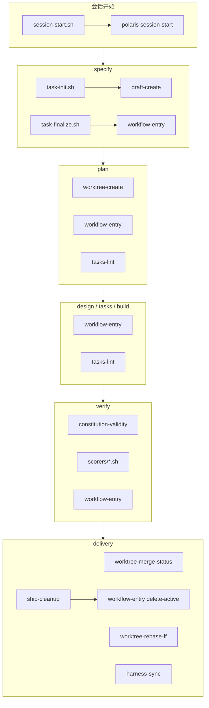

# 工作流 Hooks / Scripts：调用顺序与作用

本文档说明 Polaris Flow 主链路（specify → … → delivery）中，插件内薄包装与 TypeScript 实现（`src/core/hooks/` + `polaris-flow <name>`）的**谁调用谁、何时调用、做什么**。

- **宿主注册入口**：`assets/shared/hooks/`（安装后 `$PLUGIN_ROOT/hooks/`）— 当前仅 `session-start.sh`
- **Skill 调用薄包装**：`assets/shared/scripts/`（安装后 `$PLUGIN_ROOT/scripts/`）— workflow / worktree / lint 等
- **共用库**：`scripts/_polaris-cli.sh`（`hooks/session-start.sh` 通过相对路径 source）

> 约定：`.sh` **只驻留插件内**，不镜像到用户仓。Skill 调用 `bash "$PLUGIN_ROOT/scripts/<name>.sh"`；薄包装经 `_polaris-cli.sh` 转发到扁平 CLI。写 `.polaris/workflow.yaml` 一律走 `workflow-entry`（持锁 RMW，H12）。下文阶段表中的脚本名不加目录前缀时，默认位于 `scripts/`（`session-start` 除外，在 `hooks/`）。

---

## 1. 总览：阶段 × 脚本



| 阶段 | 脚本（调用顺序） | 作用（一句话） |
|------|------------------|----------------|
| **SessionStart** | `session-start.sh` → `polaris session-start` | 环境自检、依赖 WARN、agent/model 注入 |
| **specify** | `task-init.sh` →（内）`draft-create`；可选 `workflow-entry delete-active`；出口 `task-finalize.sh` → `rename-active` | 建 draft → 正式 `change_id` + 游标重命名 |
| **plan** | 可选 `worktree-create`；多次 `workflow-entry update-active`；出口 `tasks-lint`；再推进 phase | 隔离 worktree；切换游标；校验 tasks |
| **design** | 入口/出口 `workflow-entry update-active` | 仅推进 phase |
| **tasks** | `workflow-entry`；`tasks-lint`；再 `workflow-entry` | 细计划合规 + 游标 |
| **build** | 出口 `workflow-entry update-active` | 推进到 verify |
| **verify** | `constitution-validity` → `scorers/*.sh`（未迁）→ `workflow-entry` | 宪法 + 评分 + 游标 |
| **delivery** | `worktree-merge-status` →（可选）`worktree-rebase-ff` → `harness-sync` → `ship-cleanup` | 合回 / rebase-ff / 产物合回 / 清游标 |

`retro`、辅助 skill（`explore-router` / `idea-discovery` / `subagent-probe`）**不调用**上述交付类 hooks。

---

## 2. 路径解析（所有 Skill 共用）

```bash
PLUGIN_ROOT="$(…从 SessionStart 注入或 .polaris/config.yaml 读 plugin_root…)"
bash "$PLUGIN_ROOT/scripts/<script>.sh" [args…]
# 薄包装 → polaris-flow <script-basename> …
```

主链路业务脚本（除 `scorers/*.sh`）均已迁 TypeScript：`src/core/hooks/` + 扁平 CLI。共用 `scripts/_polaris-cli.sh`。

宿主 SessionStart（Claude 等）配置见 `assets/shared/hooks.json` 与 `assets/zh/adapters/hook-registration.md`（命令仍指向 `hooks/session-start.sh`）。

---

## 3. 分阶段调用顺序

### 3.0 会话开始（非业务阶段）

| 顺序 | 脚本 | 调用方 | 作用 |
|------|------|--------|------|
| 1 | `session-start.sh` | 宿主 SessionStart hook | 薄包装：CRLF 自愈后 `exec polaris session-start`（或 `polaris-flow`） |
| 1a | `polaris session-start` | 上一步 CLI | TS 实现：检查 `.polaris/` / `config.yaml`；探测 superpowers/openspec（WARN）；物化 workflow；写 session_id；向宿主 agents 注入 model（`challenger.model` → `model.review` → `inherit`） |

`plugin-check.sh` 为本轮**遗留**脚本（语义已移植到 `src/core/integration/detect.ts`）；Skill **不要**直接调用，除非做与 SessionStart 等价的降级自检。

---

### 3.1 specify

```text
Step 1     task-init.sh --kind change → polaris task-init
              └─ draft-create（core）          # 新建 .polaris/tasks/draft-*/ 或报 existing（同 kind）
Step 1(B)  workflow-entry delete-active   # 用户选丢弃 draft 时，逐个删游标
…澄清 / Reframe / Premise…
Step 4.4   task-finalize.sh → polaris task-finalize
              └─ workflow-entry rename-active   # draft-* → 正式 change_id
```

| 脚本 | 典型参数 | 退出码要点 |
|------|----------|------------|
| `task-init.sh` | `<repo_root> --kind change\|requirement\|testcase` | 0=新建 ok；1=已有同 kind draft（JSON `existing`）；2=环境错误 |
| `draft-create.sh` | `<repo_root> --kind …` | 由 init 封装；0=新建；1=已有同 kind draft |
| `task-finalize.sh` | `<repo_root> <draft_name> <change_id>` | 目录 mv、回填 intention 标题、rename 游标（本期仅 change） |
| `workflow-entry.sh` | `delete-active` /（finalize 内）`rename-active` | 持 `workflow.lock` 改对应 kind 列表 |

`task-init --kind` 目录约定：

| kind | 存储根 | draft | 初始 phase | 初始 state |
|------|--------|-------|------------|------------|
| `change` | `.polaris/tasks/` | `draft-*` → finalize | `specify` | change 型（intention / specify 块） |
| `requirement` | `.polaris/tasks/` | **无**；须 `--task-id` 直建正式目录 | `discovery` | PRD 型 |
| `testcase` | `.polaris/testcases/` | `draft-*` | `discovery` | testcase 型 + `testcase_plan.md` |

---

### 3.2 plan

```text
Step 1.3.A   worktree-create.sh              # 用户选 worktree 时
             workflow-entry.sh update-active # phase=plan + worktree_path
Step 1.3.B   workflow-entry.sh update-active # 主仓模式，无 worktree
…校验 intention → /opsx:propose 生成四件套…
Step 4       tasks-lint.sh                   # 粗骨架 tasks 准出
Step 5+      workflow-entry.sh update-active # 推进到 design（或下一 phase）
```

| 脚本 | 作用 |
|------|------|
| `worktree-create.sh` | 校验 `change_id`、建 `.worktrees/<id>`、`git worktree add`、拷贝运行态、写 worktree 侧 `state.yaml` |
| `tasks-lint.sh` | 机器校验 `tasks.md`：禁止 Constitution Audit / git commit / superpowers 执行头等越阶段内容 |
| `workflow-entry.sh` | 同步 `phase` / `worktree_path` |

---

### 3.3 design

```text
入口   workflow-entry.sh update-active --skill design   # phase=design
…深度设计 + design-review-agent（无 hook）…
出口   workflow-entry.sh update-active                   # 推进到 plan
```

本阶段**无**独立校验脚本；评审由 `design-review-agent` 完成。

---

### 3.4 plan

```text
入口   workflow-entry.sh update-active --skill tasks
…TDD 策略 → 覆写 tasks.md → tasks-review…
Step 5.2  tasks-lint.sh                    # 细计划准出（禁止脑补）
出口   workflow-entry.sh update-active     # 推进到 build
```

与 plan 共用 `tasks-lint.sh`，但对象是**覆写后的可执行细计划**。

---

### 3.5 build

```text
…subagent-probe → implementer /opsx:apply（无 hooks）…
出口   workflow-entry.sh update-active --skill build   # 推进到 verify
```

实施与代码评审不经过 `assets/shared/hooks/`。

---

### 3.6 verify

```text
Step 2   constitution-validity.sh     # 0=有效 / 1=无效占位 / 2=文件不存在
Step 3   scorers/<name>.sh ×5         # 评分 JSON；目录若未安装则按 skill 降级询问
出口     workflow-entry.sh update-active --skill verify
```

| 脚本 | 作用 |
|------|------|
| `constitution-validity.sh` | 检查 `openspec/memory/constitution.md` 存在、无 `[PLACEHOLDER]`、含 Core Principles 与 Version |
| `scorers/*.sh` | `audit-violation-rate`、`constitution-violation-count`、`test-coverage-scorer`、`complexity-scorer`、`doc-sync-scorer`（路径 `$PLUGIN_ROOT/scorers/`，**非** hooks 目录） |

---

### 3.7 delivery（原 ship）

仅当 `worktree.created_by_polaris_flow`（或模板字段 `created_by_easy_flow`）为真时跑 3.2–3.5；否则跳过合回，仍须做 Step 6.1 清理。

```text
Step 3.2  worktree-merge-status.sh
            0 → 已合并，跳到 3.5
            1 → 未合并，问用户 A/B/C
            2 → 脏工作区，阻断
Step 3.4  worktree-rebase-ff.sh          # 仅用户选 B
Step 3.5  polaris-sync.sh                # 合回 metrics/overrides/state → 主仓 .polaris/
          git worktree remove …          # 主代理执行，非 hook
…archive 询问（openspec-cn，非 hook）…
Step 6.1  ship-cleanup.sh
            └─ workflow-entry.sh delete-active
```

| 脚本 | 作用 |
|------|------|
| `worktree-merge-status.sh` | worktree 是否脏；分支是否已合入主干 |
| `worktree-rebase-ff.sh` | worktree rebase 到默认分支 + 主仓 `--ff-only` merge |
| sync（见下节命名债） | 确定性拷贝 harness/polaris 运行态产物到主仓；不碰业务源码 |
| `ship-cleanup.sh` | 删 `change_tasks` 中本 change；清理 `.polaris/tasks/<id>` 等残留 |

**Ship lock**：delivery 入口按 `delivery/policies/ship-lock.md` 在主仓获取 `.polaris/.locks/ship.lock`（当前为 skill/policy 约定；`change-locate.sh` 在 policy 旧稿中出现，**仓内无此脚本**，定位由 Step 0 内联完成）。

---

## 4. 横切：`workflow-entry.sh` 操作一览

所有对主仓 `.polaris/workflow.yaml` 的读写应经本脚本。YAML 含三列表：`change_tasks` / `requirement_tasks` / `testcase_tasks`；条目字段为 `task_id` / `phase` / `worktree_path` / `started_at`。

| op | 典型调用阶段 | 语义 |
|----|--------------|------|
| `get-active-changes` | 各 skill Step 0 | 只读；stdout 输出选定列表的 `task_id` JSON 数组；可 `--phase` 过滤 |
| `append-active` | 任务初始化（若启用） | 向选定列表追加 entry |
| `update-active` | plan / design / tasks / build / verify 等 | 改 `phase` / `worktree_path` |
| `rename-active` | task-finalize | `draft-*` → 正式 `task_id` |
| `delete-active` | 丢弃 draft；ship-cleanup | 移除 entry |

通用参数：`--skill <name>`、`--kind change|requirement|testcase`（**必填**）、`--repo-root <path>`。  
身份参数：`--task-id` / `--where-task-id`（已取代 `--change-id` / `--where-change-id`）。

---

## 5. 脚本依赖关系（内部调用）

```text
session-start.sh → polaris session-start
  └── detect（plugin presence）

task-init.sh → polaris task-init
  └── draft-create（core）

task-finalize.sh → polaris task-finalize
  └── workflow-entry rename-active（core）

ship-cleanup.sh → polaris ship-cleanup
  └── workflow-entry delete-active（core）

workflow-entry.sh → polaris workflow-entry
  └── workflow-lock + workflow-state（config）
```

其余脚本由 Skill **直接**调用，不再嵌套其它 hooks。

---

## 6. 仓库内脚本清单与归属

| 文件 | 目录 | 主链路是否调用 | 说明 |
|------|------|----------------|------|
| `session-start.sh` | `hooks/` | 是（宿主） | → `polaris-flow host-hook` / session-start |
| `workflow-entry.sh` | `scripts/` | 是 | → `polaris-flow workflow-entry`（H12） |
| `task-init.sh` / `specify-finalize.sh` | `scripts/` | 是 | → `task-init` / `task-finalize` |
| `tasks-lint.sh` | `scripts/` | 是 | → `polaris-flow tasks-lint` |
| `constitution-validity.sh` | `scripts/` | 是 | → `polaris-flow constitution-validity` |
| `worktree-create.sh` | `scripts/` | 是 | → `polaris-flow worktree-create` |
| `worktree-merge-status.sh` / `worktree-rebase-ff.sh` | `scripts/` | 是 | → 对应 CLI |
| `harness-sync.sh` | `scripts/` | 是 | → `polaris-flow harness-sync`（旧名 polaris-sync） |
| `ship-cleanup.sh` | `scripts/` | 是 | → `polaris-flow ship-cleanup` |
| `intention-validate.sh` | `scripts/` | 是（可选） | → `polaris-flow intention-validate` |
| `structure-create.sh` | `scripts/` | 别名 | → `draft-create` |
| `get-language-name.sh` | `scripts/` | 辅助 | 读 config 返回语言显示名 |
| `_polaris-cli.sh` | `scripts/` | 间接 | CRLF 自愈 + CLI 查找 |
| `scorers/*.sh` | `scorers/` | verify | **未迁** TS |

---

## 7. 已知命名 / 路径债（读文档时注意）

| Skill / Policy 中的名字 | 仓库实际文件 | 处理建议 |
|-------------------------|--------------|----------|
| `hooks/polaris-sync.sh` | `scripts/harness-sync.sh` | 已改路径；文案中残留旧名可忽略 |
| `hooks/change-locate.sh` | 不存在 | delivery Step 0 内联定位；可删 policy 引用 |
| `$PLUGIN_ROOT/scorers/*.sh` | 目录可能未随包发布 | verify 已有「脚本缺失 → decision-point」降级 |
| 文案中的 `.harness/` / `easy-flow` / `/ezfl:` | 目标态为 `.polaris/` / polaris-flow | 脚本与 skill 迁移中，以当前 SKILL.md 为准 |

---

## 8. 与 OpenSpec / 外部命令的边界

下列**不是** `assets/shared/hooks/` 脚本，但常与 hooks 交错出现：

| 命令 / 机制 | 阶段 | 作用 |
|-------------|------|------|
| `/opsx:propose` 等 OpenSpec 命令 | plan / build / archive | 生成或应用变更规格 |
| `openspec-cn archive` | delivery Step 5 | 归档 `openspec/changes/<id>/` |
| `git worktree add/remove` | plan / delivery | 隔离与清理；部分由 hook 封装，remove 多在 skill 内联 |
| Subagent（design-review / tasks-review / implementer） | design / tasks / build | 评审与实施，不写 workflow.yaml |

---

## 9. 快速对照：一次完整变更的脚本时间线

```text
[会话] session-start.sh → polaris session-start
[specify] task-init → draft-create
          …用户确认任务名…
          task-finalize → workflow-entry(rename)
[plan] (可选) worktree-create → workflow-entry(update)
          …生成四件套…
          tasks-lint → workflow-entry(update→design)
[design]  workflow-entry(update) …评审… workflow-entry(update→plan)
[plan]    workflow-entry(update) …覆写 tasks… tasks-lint
          …tasks-review… workflow-entry(update→build)
[build]   …apply… workflow-entry(update→verify)
[verify]  constitution-validity → scorers×5 → workflow-entry(update→delivery)
[delivery] (若有 worktree) merge-status → [rebase-ff?] → sync → worktree remove
          …archive 询问…
          ship-cleanup → workflow-entry(delete)
```

维护 hooks/scripts 时：改退出码或 JSON 契约必须同步对应阶段的 `assets/zh/skills/<phase>/SKILL.md`（英文 skill 在中文确认后再同步）。
